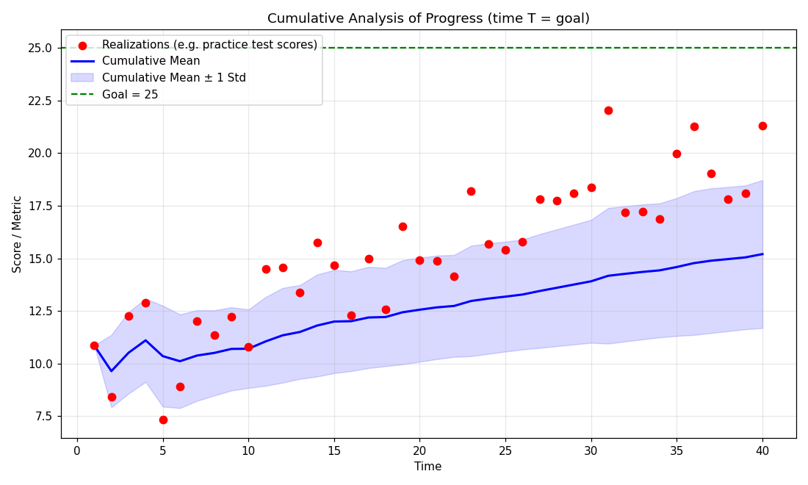
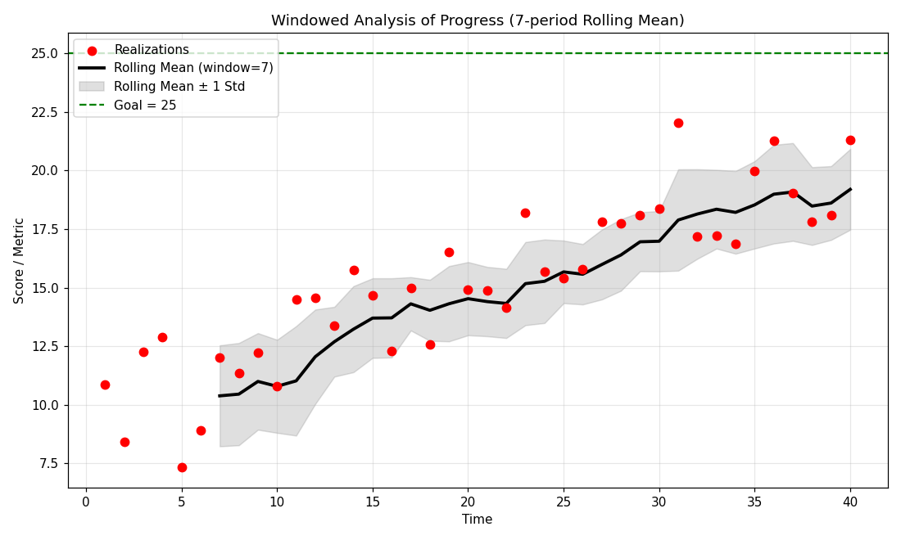

# A Quant's Visual Guide to Progress

> 本教材基于 Roman Paolucci 的教学视频 [A Quant's Visual Guide to Progress](https://www.youtube.com/watch?v=QBx-KCvNQBQ) 的内容整理而成。该视频将量化交易与时间序列分析中常用的工具，应用到日常生活中"进步"这一概念上。

---

## 1. 概述

本视频的目标很简单：**用传统统计与时间序列分析的工具，量化和解释"进步"（progress）这件事**。

我们通常在交易、金融、神经网络训练等语境下使用这些工具，但罗马（Roman）想指出的是——这些工具同样适用于日常生活中的目标设定与成长：

- 进步本质上可以被量化成一个**时间序列**（Time Series）
- 每次观测到的结果都是一个带有噪声的**实现值**（realization）
- 通过**累积分析**和**窗口分析**，我们可以看清隐藏在噪声背后的"真实水平"（true level）是否在随时间上升

> 核心思想：**进步 = 真实水平随时间上升**，而不是某一次观测到的高分或低谷。

---

## 2. 什么是"进步"：从有形到无形

### 2.1 进步的度量不一定是定量的

罗马举了很多例子来说明"进步"可以被量化：

| 例子 | 实现值（Realization） |
|------|----------------------|
| 减肥 | 每天早上称体重 |
| 跑步 | 每次跑一英里的用时 |
| 考试 | 每次模拟考试的分数 |
| 巴西柔术 | 对练、实战的表现 |
| 讲课 | 当众授课的流畅度（难以量化） |

关键点：**即使目标是无形的、难以量化的（如人际关系、讲课能力），我们仍然可以用"围绕真实水平波动"的框架去解释进步。**

### 2.2 实现值是带噪声的

任何一个单独的实现值都不能代表你的真实水平：

- 早上跑一英里用了 6 分钟，不代表你的真实水平就是 6 分钟
- 今天体重 200 磅，可能只是你喝水喝多了，不代表你的真实体重水平

这就是"噪声"（noise）——单次观测会偏离真实水平，可能是向上的偏离，也可能是向下的偏离。

---

## 3. 累积分析（Cumulative Analysis）

随着时间推移，我们可以积累这些数据点，然后计算：

- **累积均值**（Cumulative Mean）——有希望反映你当前的真实水平
- **累积方差**（Cumulative Variance）——反映观测值围绕均值波动的范围

假设目标分数是 **25**（图中的大写 T），我们从 **10** 分左右起步。下面这张图是视频中的第一张图——累积分析：



### 3.1 数据生成代码

> 说明：本视频没有配套的 Jupyter Notebook，以下代码根据视频内容重制，用于复现图中的累积分析。

```python
import numpy as np
import matplotlib.pyplot as plt

rng = np.random.default_rng(42)
T = 40          # 时间周期数
goal = 25       # 目标分数（大写 T）

# 真实水平：从 10 分起步，随时间上升到 ~20 分（技能在提高）
true_level = 10 + 10 * (np.arange(1, T + 1) / T)
# 实现值 = 真实水平 + 噪声
realizations = true_level + rng.normal(0, 2.0, size=T)

t = np.arange(1, T + 1)
cum_mean = np.cumsum(realizations) / np.arange(1, T + 1)
cum_std = np.array([np.std(realizations[:i], ddof=1) if i > 1 else 0.0
                    for i in range(1, T + 1)])

fig, ax = plt.subplots(figsize=(10, 6))
ax.scatter(t, realizations, c='red', s=45, label="Realizations")
ax.plot(t, cum_mean, 'b-', lw=2, label="Cumulative Mean")
ax.fill_between(t, cum_mean - cum_std, cum_mean + cum_std,
                color='blue', alpha=0.15, label="Cumulative Mean ± 1 Std")
ax.axhline(goal, color='green', ls='--', label=f"Goal = {goal}")
ax.set_title("Cumulative Analysis of Progress")
ax.set_xlabel("Time"); ax.set_ylabel("Score / Metric")
ax.legend(); ax.grid(alpha=0.3)
plt.show()
```

### 3.2 观测结果

从图上可以观察到：

- **红点**（实现值）整体有向上倾斜的趋势——这是在进步
- **累积均值**（蓝线）也随时间向上——它有望代表真实水平
- **方差窗口**（蓝色阴影）随时间变宽——因为数据点已经远离初始的 10 分

---

## 4. 累积分析的问题：非平稳性

累积分析虽然直观，但存在一个严重缺陷：**均值存在非平稳性（Non-stationarity）**。

### 4.1 累积均值不能代表当前水平

- 累积均值是**所有历史观测值的平均**，因此会被早期观测值拖累
- 它并不能很好地代表"时间点 40"你当前所处的水平
- 如果累积均值是当前水平的良好表示，那么当前的数据点应该围绕它均匀分布——但事实并非如此

### 4.2 向上方差被误算为向下方差

视频中指出一个更微妙的统计陷阱：

- 数据点已经普遍考在 **20 分**附近
- 但在累积方差中，**向上的偏离**（比如考了 22、23 分）也被算进相对于累积均值的"下行方差"里
- 这导致方差窗口被严重高估——我们根本不会期望考出 15、10 分甚至更低

> **结论**：当水平随时间变化（非平稳）时，累积均值与累积方差都会失真。在时间序列分析中，这意味着不能用累积统计量来刻画当前状态。

---

## 5. 窗口分析（Windowed Analysis）

为了解决非平稳性问题，改用**滚动窗口**来分析：

- 使用 **7 期滚动均值**（Rolling Mean）来代表当前真实水平
- 用 **±1 个标准差**来刻画围绕当前水平的离散程度（方差窗口）



### 5.1 窗口分析代码

```python
window = 7
rolling_mean = np.full(T, np.nan)
rolling_std = np.full(T, np.nan)

for i in range(window - 1, T):
    rolling_mean[i] = np.mean(realizations[i - window + 1: i + 1])
    rolling_std[i] = np.std(realizations[i - window + 1: i + 1], ddof=1)

fig, ax = plt.subplots(figsize=(10, 6))
ax.scatter(t, realizations, c='red', s=45, label="Realizations")
ax.plot(t, rolling_mean, 'k-', lw=2.5, label=f"Rolling Mean (window={window})")
ax.fill_between(t, rolling_mean - rolling_std, rolling_mean + rolling_std,
                color='gray', alpha=0.25, label="Rolling Mean ± 1 Std")
ax.axhline(goal, color='green', ls='--', label=f"Goal = {goal}")
ax.set_title("Windowed Analysis of Progress")
ax.set_xlabel("Time"); ax.set_ylabel("Score / Metric")
ax.legend(); ax.grid(alpha=0.3)
plt.show()
```

### 5.2 窗口分析的优点

- **滚动均值**只使用最近 7 次实现值的平均，能够及时跟上水平的变化
- 相比累积均值，滚动均值向上倾斜的幅度**显著更大**（不被早期观测拖累）
- **滚动方差窗口**（±1 标准差）是对"当前水平附近单次表现的波动范围"的合理近似

例如：在时间点 7 附近，平均水平大约是 13 分，±1 个标准差就刻画了"状态好的时候能考多少、状态差的时候会考多少"。

---

## 6. 方差窗口：进步为什么"看起来像倒退"

### 6.1 单点波动 ≠ 没有进步

视频中举了一个典型的挫败场景：

1. 你努力备考，考了个 **16 分**（接近方差窗口顶部）
2. 紧接着两次考试掉到 **12 分**（方差窗口底部）
3. 你会想：我是不是没有进步？

**答案是否定的。** 你依然在进步——你只是恰好实现到了自己潜力的下沿（variance window 的底部）。单次实现值落在窗口内任何位置，都不改变真实水平正在上升这一事实。

### 6.2 类比交易中的"正期望积累"

罗马给出了一个量化交易视角的类比：

> 你的"进步"（黑线 = 滚动均值所代表的真实水平）持续向上，就像在交易中**随时间积累正期望值**。而围绕它的方差窗口，就像单次交易 P&L 的上下波动——波动不会改变期望值为正的事实。

```
进步 = 积累正期望值（黑色趋势线向上）
波动 = 单次交易 / 单次观测的 P&L 噪声（方差窗口永远存在）
```

---

## 7. 如何"阅读"自己的进步

### 7.1 两条关键元素

- **黑线（真实水平）**：只要持续做接近目标的事（每天训练、吃好、学好、练好），黑线就会持续向上
- **方差窗口（单日波动）**：它永远存在，是你任何一天的上行潜力和下行潜力的范围

### 7.2 缩小方差窗口

方差窗口并非完全不可控。通过改进可控因素，可以让波动收窄：

| 因素 | 效果 |
|------|------|
| 营养计划不规律、有时暴食 | 方差变大 |
| 饮食时好时坏 | 方差变大 |
| 饮食更加稳定、规律 | 方差窗口收窄 |

> 核心思想：**你控制不了单次观测落在窗口内哪个位置，但你可以通过好习惯收窄整个窗口，并让黑线稳定向上。**

---

## 8. 应用：无法量化时如何判断进步

并不是所有目标都有定量指标（定性指标更难度量进步）。罗马以自己**讲课**为例：

- 刚开始讲课需要逐字讲稿，现在可以即兴、连贯地组织想法
- 任何一天都可能讲得好或讲得差（围绕黑线的波动）
- 但**年复一年**，那条黑线确实在向右上方延伸——早期视频 vs 现在视频的对比就是证据

> **结论**：即使无法量化"红点"，你仍然可以用这张图的框架来理解和可视化自己的进步。

---

## 9. 关键要点总结

| 概念 | 要点 |
|------|------|
| **实现值（Realization）** | 单次观测结果，带有噪声，不代表真实水平 |
| **真实水平（True Level）** | 你当前真正所处的水平，由滚动均值近似 |
| **累积分析** | 累积均值 + 累积方差；受非平稳性影响，被早期观测拖累 |
| **非平稳性** | 水平随时间变化，导致累积统计量失真 |
| **窗口分析** | 7 期滚动均值 ± 1 标准差；及时刻画当前水平与波动 |
| **方差窗口** | 单日/单次的上行与下行潜力，永远存在 |
| **进步 = 黑线上行** | 真实水平随时间上升，而非单次高分 |
| **缩小方差窗口** | 通过稳定、规律的好习惯（如稳定的营养计划） |

### 一句话总结

> 把进步看成一条带噪声的上升趋势线：**黑线（真实水平）向上就是进步，方差窗口（噪声）永远存在但不必当真**。持续做接近目标的事，黑线就会向右上方延伸——这就是进步的"量化视图"。

---

## 10. 延伸阅读

- [Quant Guild 官网](https://quantguild.com)
- [Quant Guild 博客](https://medium.com/quant-guild)
- [Quant Guild GitHub](https://github.com/Quant-Guild)
- [Quant Guild Discord](https://discord.com/invite/MJ4FU2c6c3)

---

*本教材由 Roman Paolucci 的教学视频 [A Quant's Visual Guide to Progress](https://www.youtube.com/watch?v=QBx-KCvNQBQ) 整理而成。*
