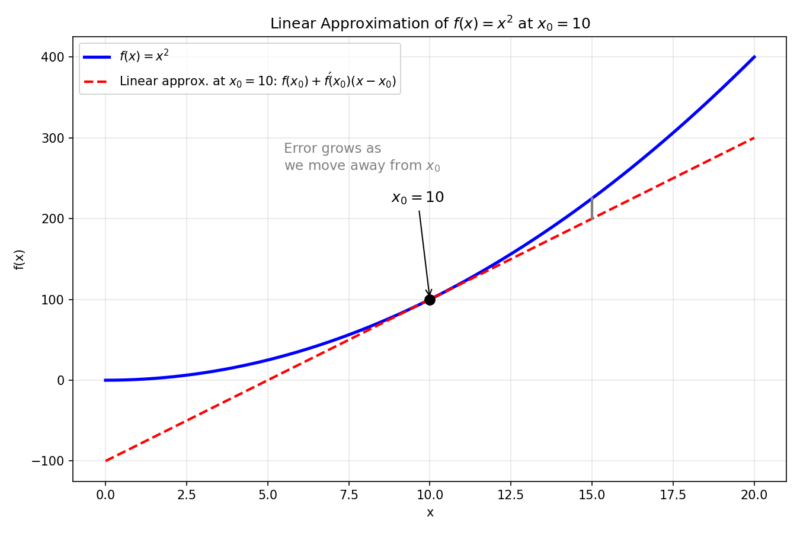
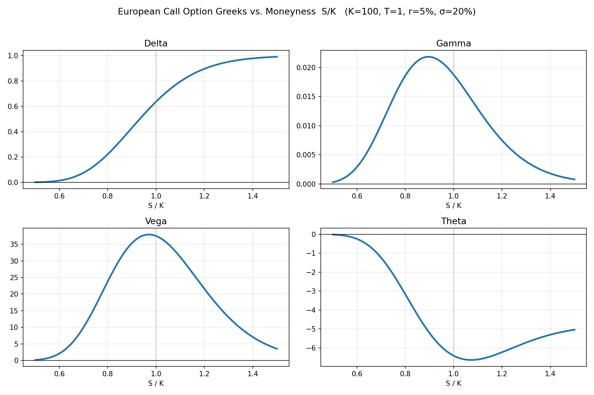
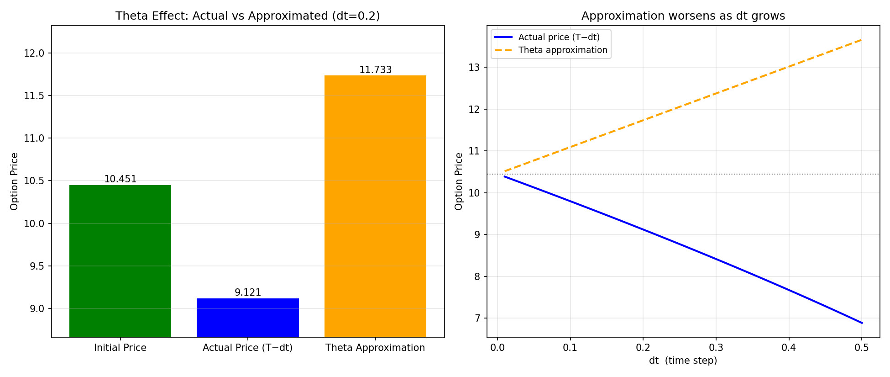

# Managing Option Portfolios with Black-Scholes Greeks

> 本教材基于 Roman Paolucci 的教学视频 [Managing Option Portfolios with Black-Scholes Greeks](https://www.youtube.com/watch?v=Augr2c-PMc4) 的内容整理而成。视频从"线性近似"这一最基础的数学直觉出发，逐步构建出期权组合管理中最重要的工具——希腊字母（Greeks），并解释了市场做市商（market maker）如何用它们来对冲风险敞口。

---

## 1. 概述

本视频的核心思想可以浓缩为一句话：

> **希腊字母（Greeks）本质上就是对期权定价函数（Black-Scholes 模型）在各个输入变量上所做的"线性近似"（linear approximation）。**

期权价格是一个高度非线性的函数，但当某个输入发生**很小的变化**时，我们可以用一条切线（一阶泰勒展开）来近似地估计期权价格会变化多少。这条切线的斜率，就是各个希腊字母。

掌握这套思想后，你将能够回答三个问题：

1. 如果我持有一篮子期权，当基础资产价格、时间、波动率、利率发生变化时，我的组合价值会怎样变化？
2. 作为市场做市商，我如何让自己的组合**对市场波动"无感"**（Delta 中性、Vega 中性……），从而安心地赚取买卖价差（bid-ask spread）？
3. 为什么做市商**用股票对冲 Delta，却必须用其它期权来对冲 Theta、Vega、Rho**？

视频分为三大部分：

- **线性近似（Linear Approximation）**：用 $f(x)=x^2$ 的切线近似，直观理解一阶泰勒展开
- **Black-Scholes 模型与希腊字母**：Delta、Theta、Vega、Rho、Gamma 的定义与计算
- **管理期权组合与对冲策略**：做市商如何组合期权与股票来消除风险敞口

---

## 2. 线性近似：一切希腊字母的数学起点

### 2.1 一阶泰勒展开（First-Order Taylor Expansion）

对一个函数 $f(x)$，在兴趣点 $x_0$ 处的一阶线性近似为：

$$
f(x) \approx f(x_0) + f'(x_0)\,(x - x_0)
$$

这里的 $x_0$ 可以取任意"兴趣点"：当前市场价格、当前市场参数集合、去年产生利润/成本的参数集合……都可以。函数本身也可以是任何东西——期权定价函数、利润函数、成本函数——这个近似都成立。

对于 $f(x) = x^2$：

- $f(x_0) = x_0^2$
- $f'(x) = 2x$，所以 $f'(x_0) = 2x_0$

于是线性近似为：

$$
f(x) \approx x_0^2 + 2x_0\,(x - x_0)
$$

### 2.2 直观理解：用一条直线去近似一条曲线

"线性近似"——"线性"就是"直线"。我们是用一条**直线**（红色切线）去近似一个**非线性函数**（蓝色曲线 $x^2$）。



从上图可以看到三个关键观察：

- **在 $x_0$ 附近，红线与蓝线几乎重合**——近似非常好；
- **离 $x_0$ 越远，两条线的距离（即误差，error）越大**——因为 $x^2$ 的增长比直线快得多；
- **这条近似是"局部"的**——一旦离开兴趣点太远，就必须在**新的兴趣点**重新计算一次线性近似，这正是做市商需要**持续重新校准**希腊字母的原因。

> 本代码来自配套 Jupyter Notebook（`Managing Option Portfolios.ipynb`）。下面的交互式代码（ipywidgets）可以拖动滑块改变 $x_0$，直观地看到切线近似如何变化。

```python
import numpy as np
import matplotlib.pyplot as plt
from ipywidgets import interact

def linear_approximation(x0, x):
    return x0**2 + 2*x0*(x - x0)

def plot_approximation(x0):
    x = np.linspace(x0 - 10, x0 + 10, 400)
    y = x**2
    y_lin = linear_approximation(x0, x)

    plt.figure(figsize=(8, 6))
    plt.plot(x, y, label=r'$f(x)=x^2$', color='blue')
    plt.plot(x, y_lin, label=f'Linear Approximation at x={x0}', linestyle='--', color='red')
    plt.title(r'Linear Approximation of $x^2$ at $x_0$')
    plt.xlabel('x')
    plt.ylabel('f(x)')
    plt.legend()
    plt.grid(True)
    plt.show()

interact(plot_approximation, x0=(-10, 10, 1));
```

### 2.3 数值验证：实际变化 vs 近似变化

从 $x_0 = 10$ 出发，向右移动 $\Delta x = 0.1$：

- **实际函数变化**：$f(10.1) - f(10) = 102.01 - 100 = 2.01$
- **近似函数变化**：$f'(10) \times 0.1 = 20 \times 0.1 = 2.0$

误差只有 $0.01$——这是一个非常好的近似。但如果我们移动 $\Delta x = 5$，近似误差就会变得显著；$\Delta x = 10$、$\Delta x = 50$ 时误差持续放大，因为 $x^2$ 的增长速度远超直线。

> 本代码来自配套 Jupyter Notebook（`Managing Option Portfolios.ipynb`）。

```python
center = 10
change = .1

# Actual Function
def f(x):
    return x ** 2

# Taylor series approximation
def af(x, x0):
    return f(x0) + 2*x0*(x - x0)

# Actual Change
print('Actual Function Change:', f(center + change) - f(center))

# Approx Change
print('Approx Function Change:', af(center + change, center)- f(center))
```

### 2.4 核心启示：如何"解读"线性近似

线性近似的实用性在于它回答了一个非常简单的问题：

> 当某个输入发生一个**单位变化**（unit change）时，函数整体会上升还是下降？大约变化多少？

- 价格函数：输入变 1 个单位，价格怎么变？
- 利润函数：增加劳动力/原材料，利润怎么变？
- 成本函数：输入变 1 个单位，成本怎么变？

这几乎是"零成本"地获得对整体函数行为的高层级理解。而期权希腊字母，正是把这个思路分别应用到 Black-Scholes 模型的每一个输入变量上。

---

## 3. 从线性近似到期权定价：Black-Scholes 模型

欧洲看涨期权（European call option）的 Black-Scholes 定价公式：

$$
\text{Call Price} = S\,N(d_1) - K\,e^{-rT}\,N(d_2)
$$

其中：

$$
d_1 = \frac{\ln(S/K) + (r + \sigma^2/2)\,T}{\sigma\sqrt{T}}, \qquad d_2 = d_1 - \sigma\sqrt{T}
$$

$N(\cdot)$ 是标准正态分布的累积分布函数。

变量含义：

| 变量 | 含义 | 在期权存续期内是否可变 |
|------|------|------------------------|
| $S$ | 基础资产价格（underlying asset price） | 随时变化 |
| $T$ | 到期时间（time to maturity） | 每天减少 |
| $\sigma$ | 波动率（volatility / implied volatility） | 每天变化（隐含波动率由市场均衡价格反推） |
| $r$ | 无风险利率（risk-free rate） | 可以变化 |
| $K$ | 行权价（strike price） | **固定不变** |

与 $x^2$ 一样，Black-Scholes 价格也是一个**非线性函数**。于是我们可以对它做同样的**一阶泰勒展开**——对每一个可变的输入分别计算**偏导数**，就得到了一条对应每个输入的"切线"（线性近似）：

- 针对基础资产价格变化的线性近似 → **Delta（Δ）**
- 针对时间变化的线性近似 → **Theta（Θ）**
- 针对波动率变化的线性近似 → **Vega（ν）**
- 针对利率变化的线性近似 → **Rho（ρ）**

之所以**没有针对行权价的敏感性**，正是因为行权价在合约存续期内是固定的——它不会变化，也就不产生风险敞口。

---

## 4. 希腊字母（Greeks）：对每个输入的线性近似

### 4.1 五大希腊字母的含义

| 希腊字母 | 敏感性对象 | 通俗含义 |
|---------|-----------|---------|
| **Delta（Δ）** | 基础资产价格 $S$ | 标的价格涨 1 元，期权价格大约变多少 |
| **Theta（Θ）** | 时间 $T$ | 时间每过一天，期权价格衰减多少（时间衰减） |
| **Vega（ν）** | 波动率 $\sigma$ | 隐含波动率升 1%，期权价格大约变多少 |
| **Rho（ρ）** | 利率 $r$ | 利率升 1%，期权价格大约变多少 |
| **Gamma（Γ）** | 基础资产价格 $S$（二阶） | Delta 自身随标的价格变化有多快 |

### 4.2 计算公式（Black-Scholes 一阶偏导数）

> 本代码来自配套 Jupyter Notebook（`Managing Option Portfolios.ipynb`）。

```python
import scipy.stats as si

def black_scholes_call(S, K, T, r, sigma):
    """Calculate European call option price using Black-Scholes model."""
    d1 = (np.log(S / K) + (r + sigma**2 / 2)*T) / (sigma * np.sqrt(T))
    d2 = d1 - sigma * np.sqrt(T)
    call_price = S * si.norm.cdf(d1) - K * np.exp(-r * T) * si.norm.cdf(d2)
    return call_price, d1, d2

def call_delta(S, K, T, r, sigma):
    """Delta: sensitivity to underlying price changes."""
    d1 = (np.log(S / K) + (r + sigma**2 / 2)*T) / (sigma * np.sqrt(T))
    return si.norm.cdf(d1)

def call_theta(S, K, T, r, sigma):
    """Theta: time decay of the option price."""
    d1 = (np.log(S / K) + (r + sigma**2 / 2)*T) / (sigma * np.sqrt(T))
    d2 = d1 - sigma * np.sqrt(T)
    term1 = - (S * si.norm.pdf(d1) * sigma) / (2 * np.sqrt(T))
    term2 = r * K * np.exp(-r*T) * si.norm.cdf(d2)
    return term1 - term2

def call_vega(S, K, T, r, sigma):
    """Vega: sensitivity to volatility."""
    d1 = (np.log(S / K) + (r + sigma**2 / 2)*T) / (sigma * np.sqrt(T))
    return S * si.norm.pdf(d1) * np.sqrt(T)

def call_rho(S, K, T, r, sigma):
    """Rho: sensitivity to interest rate."""
    d1 = (np.log(S / K) + (r + sigma**2 / 2)*T) / (sigma * np.sqrt(T))
    d2 = d1 - sigma * np.sqrt(T)
    return K * T * np.exp(-r*T) * si.norm.cdf(d2)
```

对应的一阶偏导数解析式：

- **Delta**：$\Delta = \dfrac{\partial C}{\partial S} = N(d_1)$
- **Theta**：$\Theta = \dfrac{\partial C}{\partial T} = -\dfrac{S\,N'(d_1)\,\sigma}{2\sqrt{T}} - rK e^{-rT} N(d_2)$（看涨期权通常为负——时间衰减）
- **Vega**：$\nu = \dfrac{\partial C}{\partial \sigma} = S\,N'(d_1)\,\sqrt{T}$
- **Rho**：$\rho = \dfrac{\partial C}{\partial r} = K\,T\,e^{-rT}\,N(d_2)$
- **Gamma**：$\Gamma = \dfrac{\partial^2 C}{\partial S^2} = \dfrac{N'(d_1)}{S\,\sigma\sqrt{T}}$

### 4.3 数值例子：从"单位变化"解读希腊字母

> 本代码来自配套 Jupyter Notebook（`Managing Option Portfolios.ipynb`）。

```python
# Example: Compute the call price and Greeks for a sample set of parameters
S = 101       # Underlying price
K = 100       # Strike price
T = 1         # Time to maturity (years)
r = 0.05      # Risk-free rate
sigma = 0.2   # Volatility

price, d1, d2 = black_scholes_call(S, K, T, r, sigma)
delta = call_delta(S, K, T, r, sigma)
theta = call_theta(S, K, T, r, sigma)
vega = call_vega(S, K, T, r, sigma)
rho = call_rho(S, K, T, r, sigma)

print(f"Call Option Price: {price:.2f}")
print(f"Delta: {delta:.2f}")
print(f"Theta: {theta:.2f}")
print(f"Vega: {vega:.2f}")
print(f"Rho: {rho:.2f}")
```

在视频演示的参数下（Delta ≈ 0.67、期权价格 ≈ 11.76）：

- 若基础资产价格上涨 1 元，线性近似告诉我们看涨期权价格大约上涨 **0.67**；验证结果显示实际价格确实上涨约 0.64——因为这是一个**近似**，存在微小误差，但对解读和理解而言可以忽略；
- 若基础资产价格下跌 1 元，则期权价格约变为 **11.10**，与实际结果一致。

视频中反复强调了一个细节：**Delta 本身也是一个非线性函数**（从 0.64 跳到 0.66、再到 0.67）。所以我们每次只做一个"单位变化"的局部近似，不能外推得太远。

---

## 5. 希腊字母随标的价格的变化

下图用 matplotlib 复现了视频中的核心图表：在 $K=100, T=1, r=5\%, \sigma=20\%$ 下，欧式看涨期权的 Delta、Gamma、Vega、Theta 随实值程度（$S/K$）的变化曲线。



可以观察到：

- **Delta**：从 0 到 1 的 S 型（sigmoid）曲线，在平值（$S/K=1$）附近斜率最大；
- **Gamma**：在平值附近达到峰值——这正是 Delta 变化最快、最需要重新对冲的区域；
- **Vega**：同样在平值附近最高——平值期权对波动率最敏感；
- **Theta**：通常为负（时间衰减），其形状随实值程度而变。

这些曲线的形状，正是做市商决定"在哪个位置对冲、用什么工具对冲"的依据。

---

## 6. 市场做市商如何管理风险敞口

### 6.1 为什么线性近似如此有用：净敞口

如果做市商同时交易同一标的（比如苹果）上的几百份不同期权合约，它们各自有不同的 Delta、Theta、Vega、Rho。由于**线性近似是线性的**，组合的净希腊字母可以直接**加总**：

$$
\text{Portfolio Delta} = \sum_i \text{Delta}_i, \qquad \text{Portfolio Vega} = \sum_i \text{Vega}_i, \quad \ldots
$$

于是做市商几乎不费吹灰之力就能获得整个组合风险的高层级视图：

- **净多头 Delta（net long Delta）**：标的价格上涨 → 组合价值上升；
- **净空头 Delta（net negative Delta）**：标的价格上涨 → 组合价值下降。

同理可判断自己在 Vega、Theta、Rho 上是正敞口还是负敞口，以及"希望市场往哪个方向走才能赚钱"。

### 6.2 Delta 用股票对冲

Delta 是唯一一个可以**直接用基础资产（股票）对冲**的希腊字母：

- 组合净多头 Delta → **卖空**一些股票；
- 组合净空头 Delta → **买入**一些股票。

因为股票的 Delta 恒为 1（价格涨 1 元，股票本身涨 1 元），且**股票不附带任何 Vega、Theta、Rho**——股票对波动率、时间、利率没有期权式的敏感性。

### 6.3 Theta、Vega、Rho 用期权对冲

Theta、Vega、Gamma、Rho 这些敞口**无法用股票直接对冲**，因为股票不产生这些敏感性。它们只能来自期权合约本身，因此做市商必须**交易其它期权**来对冲：

- **Theta（时间衰减）**：虽然时间衰减不可回避，但可以通过持有不同到期期限（maturity）的期权来管理整体时间衰减；
- **Vega（波动率）**：用不同波动率敏感度 / 不同行权价的期权来抵消波动率风险；
- **Rho（利率）**：用对利率敏感度不同的期权来管理利率风险。

### 6.4 对冲：一个方程组 / 优化问题

做市商的目标是让自己成为**市场中性**（net neutral exposure）的：当基础资产变化、时间流逝、波动率变化时，组合价值几乎不变，然后安心地赚取买卖价差。

具体做法是解一个**方程组 / 优化问题**：

1. 先在市场上挑选一批期权合约；
2. 每个新加入的合约都会带来**它自己的** Delta、Theta、Vega、Rho，必须计入组合；
3. 目标是寻找一组合约的组合，使 Portfolio Delta ≈ 0、Portfolio Theta ≈ 0、Portfolio Vega ≈ 0……

由于只有期权才带有 Theta/Vega/Gamma，因此**先**用期权把除 Delta 外的敞口全部对冲干净；然后根据剩下的**净 Delta 头寸**，去买入或卖出股票，把最后一个敞口也中和掉。这就把对冲问题变成了一个带约束的线性方程组求解问题。

---

## 7. 近似的局限性：参数变化与二阶敏感性

视频最后强调了线性近似的两个重要局限：

1. **线性近似假定"其它参数保持不变"**。但现实中所有参数都在变。当参数集合改变时，近似的**有效性本身也会改变**——期权价格对近似变得"更敏感"或"更不敏感"，远离兴趣点时的误差也随之改变。

2. **实值程度（moneyness）影响近似的质量**。视频展示了 Theta 近似图：当时间步长 $dt$ 增大时，Theta 近似明显偏离实际价格；而处于深度实值（deep in the money）时误差相对较小。

下图左侧复现了视频/Notebook 中的 Theta 近似柱状图，右侧展示了**时间步长 $dt$ 越大、近似误差越大**的现象。



> 本代码来自配套 Jupyter Notebook（`Managing Option Portfolios.ipynb`）。

```python
def theta_approximation_chart(S=100, K=100, T=1, r=0.05, sigma=0.2, dt=0.01):
    # Current price and theta at time T
    price, _, _ = black_scholes_call(S, K, T, r, sigma)
    theta_val = call_theta(S, K, T, r, sigma)

    # New time to maturity is T - dt (ensure positive time)
    T_new = T - dt if T - dt > 0 else 0.001

    # Compute the actual new price at T_new
    new_price, _, _ = black_scholes_call(S, K, T_new, r, sigma)

    # Approximate new price using the theta sensitivity (note: theta is typically negative for calls)
    approx_price = price + theta_val * (-dt)

    # Plot the initial price, the actual new price, and the theta approximation
    labels = ['Initial Price', 'Actual Price (T-dt)', 'Theta Approximation']
    values = [price, new_price, approx_price]

    plt.figure(figsize=(8, 6))
    plt.bar(labels, values, color=['green', 'blue', 'orange'])
    plt.title("Theta Effect: Actual vs. Approximated Option Price Change")
    plt.ylabel("Option Price")
    plt.ylim([min(values)*0.95, max(values)*1.05])
    plt.show()

    error = new_price - approx_price
    print(f"Initial Price: {price:.2f}")
    print(f"New Price (with T-dt): {new_price:.2f}")
    print(f"Approximated Price (using Theta): {approx_price:.2f}")
    print(f"Error (Actual - Approximation): {error:.4f}")

from ipywidgets import interact
interact(theta_approximation_chart,
         S=(50, 150, 1),
         K=(50, 150, 1),
         T=(0.1, 2, 0.1),
         r=(0.0, 0.1, 0.005),
         sigma=(0.1, 0.5, 0.01),
         dt=(0.001, 0.2, 0.001));
```

这就引出了**二阶敏感性**的概念：除了期权价格对各输入的一阶偏导（Greeks），我们还可以计算二阶偏导、交叉偏导（cross partials）——例如 Gamma（Delta 的变化速率）、Charm（Delta 对时间的变化）等。这些量告诉我们"希腊字母本身会变化得多快"，是做市商决定何时再平衡（rebalancing）的关键。视频预告这些问题将在后续视频中深入讨论。

---

## 8. 表格总结：各希腊字母

| 希腊字母 | 定义（敏感性对象） | Black-Scholes 公式中的偏导 | 组合风险含义 | 对冲工具 |
|---------|-------------------|--------------------------|-------------|---------|
| **Delta（Δ）** | 对基础资产价格 $S$ 的一阶敏感度 | $\partial C/\partial S = N(d_1)$ | 标的价格变动导致组合价值变动；净值 > 0 时希望标的上行 | **基础资产（股票）**：正 Delta 用卖空、负 Delta 用买入 |
| **Theta（Θ）** | 对时间 $T$ 的敏感度（时间衰减） | $\partial C/\partial T = -\dfrac{S N'(d_1)\sigma}{2\sqrt{T}} - rKe^{-rT}N(d_2)$ | 时间流逝侵蚀期权价值（看涨通常为负） | **其它期权**（不同到期期限组合） |
| **Vega（ν）** | 对波动率 $\sigma$ 的敏感度 | $\partial C/\partial \sigma = S N'(d_1)\sqrt{T}$ | 隐含波动率变动风险（恐慌/事件时波动率上升） | **其它期权**（不同波动率/行权价） |
| **Rho（ρ）** | 对无风险利率 $r$ 的敏感度 | $\partial C/\partial r = K T e^{-rT} N(d_2)$ | 利率变动风险 | **其它期权**（对利率敏感度不同的期权） |
| **Gamma（Γ）** | 对基础资产价格 $S$ 的**二阶**敏感度（Delta 的 Delta） | $\partial^2 C/\partial S^2 = \dfrac{N'(d_1)}{S\sigma\sqrt{T}}$ | Delta 自身变化的速度；平值附近最大 | 二阶对冲，只能用期权（不能只靠股票） |

---

## 9. 关键要点总结

| 概念 | 要点 |
|------|------|
| **线性近似** | 用一阶泰勒展开（切线）近似非线性函数；在兴趣点附近有效，远离则误差增大 |
| **希腊字母 = 线性近似** | 每个希腊字母都是 Black-Scholes 定价函数对某一输入的偏导数（切线斜率） |
| **无行权价敏感性** | 行权价在合约存续期内固定，不产生风险敞口 |
| **净敞口可加总** | 因为线性，组合的 Delta/Theta/Vega/Rho 可以直接对各合约加总 |
| **Delta 用股票对冲** | 股票 Delta=1、且无 Vega/Theta/Rho，适合中和最后剩余的 Delta |
| **Theta/Vega/Rho 用期权对冲** | 只有期权才带这些敏感性，必须用其它期权来对冲 |
| **对冲 = 解方程组** | 先凑期权组合使各希腊字母归零，再用股票中和剩余 Delta |
| **近似是局部的** | 参数变化/实值程度改变时，近似的有效性随之改变，需要持续重算（再平衡） |
| **二阶敏感性** | Gamma、Charm、交叉偏导等，描述希腊字母自身的变化速率 |

### 一句话总结

> **希腊字母就是 Black-Scholes 定价函数在每一个输入方向上的"切线斜率"（一阶泰勒近似）。**做市商把它们逐项加总得到组合净敞口，用股票对冲 Delta，用其它期权对冲 Theta、Vega、Rho，从而让自己对市场"无感"、专心赚取买卖价差；而由于近似是局部的，这套对冲必须随市场变化持续重新校准。

---

## 10. 延伸阅读

- 视频配套 Jupyter Notebook：[Managing Option Portfolios.ipynb](https://github.com/romanmichaelpaolucci/Quant-Guild-Library/blob/main/2025%20Video%20Lectures/11.%20Managing%20Option%20Portfolios%20with%20Black-Scholes%20Greeks/Managing%20Option%20Portfolios.ipynb)
- [Approximating Derivatives（近似求导）](https://www.youtube.com/watch?v=CD8XYP4lq4g)
- [Black-Scholes Equation Derivation（Black-Scholes 方程推导）](https://www.youtube.com/watch?v=2iClLEfXuqA) 与 [配套文章](https://medium.com/swlh/deriving-the-black-scholes-model-5e518c65d0bc)
- [European Options 101（欧式期权入门）](https://www.youtube.com/watch?v=HgjeDJVCHSo)
- [Market Implied Volatility（市场隐含波动率）](https://www.youtube.com/watch?v=VzieTIsBaHM)
- [Quant Guild 官网](https://quantguild.com) 与 [博客](https://medium.com/quant-guild)
- [开源做市游戏 Practice Market Making](https://practicemarketmaking.com)

---

*本教材由 Roman Paolucci 的教学视频 [Managing Option Portfolios with Black-Scholes Greeks](https://www.youtube.com/watch?v=Augr2c-PMc4) 整理而成。*
