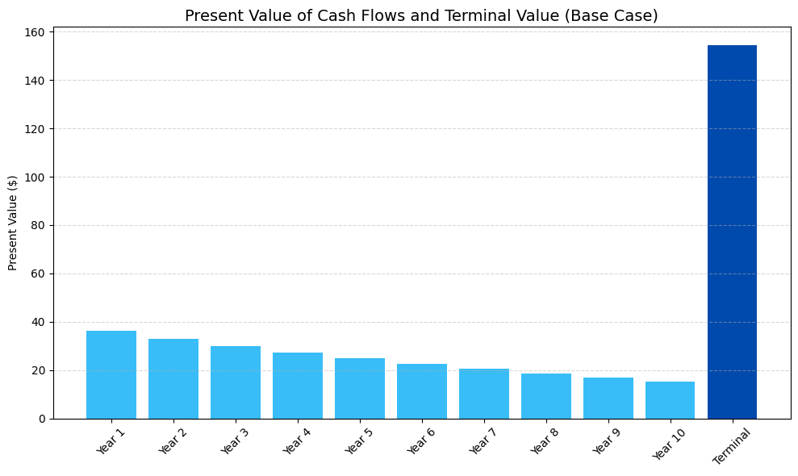
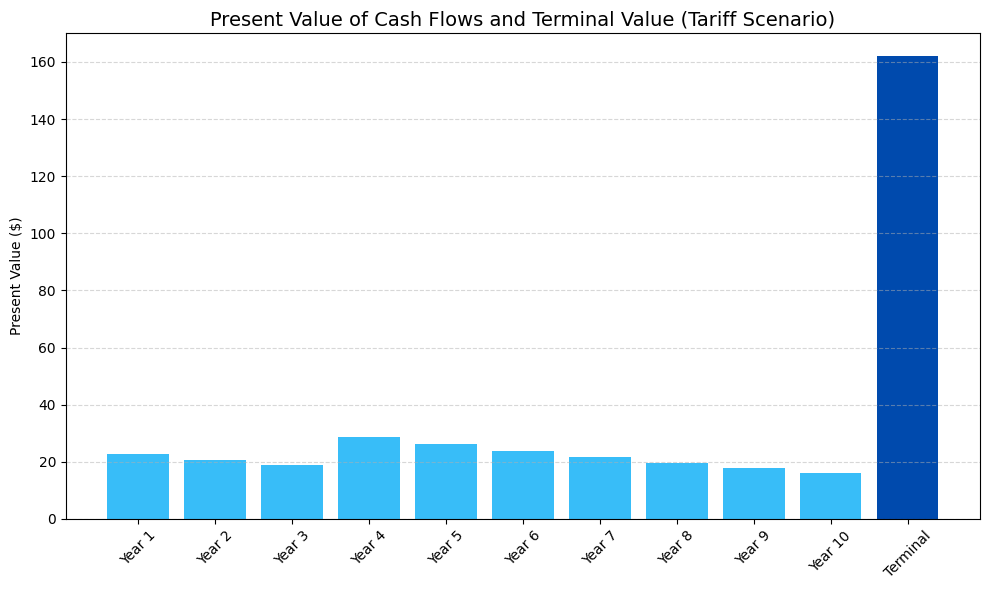
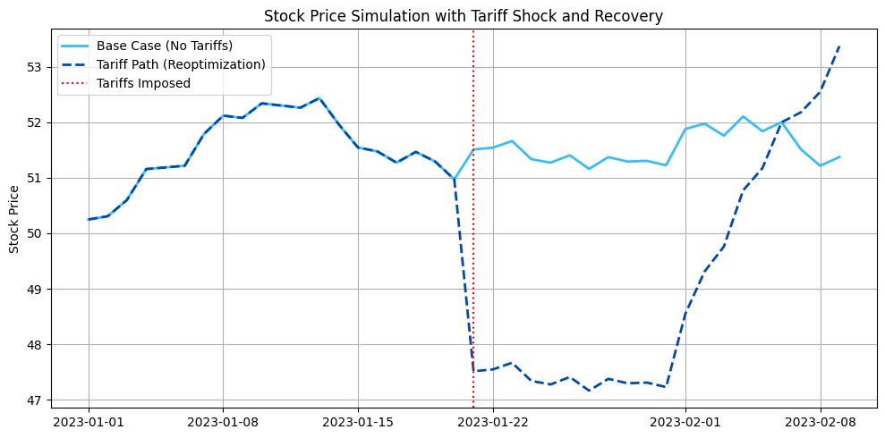

# Equity Trading and Tariffs：用 DCF 量化关税对股票市场的影响

> 本教材基于 Roman Paolucci 的教学视频 [Equity Trading and Tariffs](https://www.youtube.com/watch?v=Yms19aI3eu4) 的内容整理而成。该视频用一个"柠檬水摊"的 DCF 模型，演示如何量化地分析关税（tariffs）等宏观政策事件对股票/权益（equities）市场的影响，并据此寻找交易机会。

---

## 1. 概述

当出现重大制度性变化（regime changes）时——例如新一届政府及其关税政策——股票市场往往会出现剧烈的定价波动。本视频的核心思想是：

**抛开政治与噪音，纯粹用量化推测（quantitative conjecture）的视角，观察关税如何改变一家公司未来现金流的现值（present value），进而影响股票价格，并从中识别交易机会。**

罗马（Roman）给出的"镜头"非常特别：他更关注**钱的流向**（where money is going），而不是"价值是被创造还是被摧毁"。也就是说，短期冲击引发的价值下跌，可能只是一个可以被"逢低买入"（buying the dip）利用的价值缺口（value gap），而非长期的毁灭性损失。

整个分析框架建立在一个经典模型之上：**贴现现金流（Discounted Cash Flow，DCF）分析**。

> 核心思想：**关税在短期内压低股票价格，但公司会重新优化（reoptimize）成本结构，长期价值有望恢复甚至超越基准情形——这中间的"价值缺口"就是量化交易者可以建模并利用的对象。**

---

## 2. 背景：关税是宏观事件的"政策冲击"

### 2.1 用 DCF 看待股价的两个世界

DCF 的做法是：预测一家公司未来一定时间内的现金流，把之后每年的现金流按永续（in perpetuity）方式估值，然后把所有现金流贴现回现在，减去除去债务、除以总流通股本，得到一个模型化的股票价格。

罗马把这个过程放到**两种世界状态**下对比：

| 世界状态 | 政策环境 | 现金流表现 |
|---------|---------|-----------|
| 基准情形（Base Case） | 无关税 | 进口商品，成本保持低位，利润稳定 |
| 关税情形（Tariff Scenario） | 加征关税 | 短期成本上升、利润下降，随后重新优化恢复 |

### 2.2 为什么要关注"钱的流向"

关税会直接抬高进口成本，压低企业利润。但关键在于：

- 公司不会坐以待毙、接受关税成为利润负担——**公司的目标是利润最大化**（IPO 之后对股东负有最大化价值的责任）
- 如果进口不再划算，公司会转而在国内采购；无论国内还是国际，只要能最大化现金流创造能力就行
- 如果成本函数（cost function）上升，公司会想办法在别处抵消——劳动力市场、砍掉低效项目等

> 因此，关税对企业的现金流冲击**往往是暂时的**：短期利润下降，但经过"重新调整（reordering）、重组（restructuring）、重新优化（reoptimization）"之后，现金流创造能力会回归甚至超越原有水平。

---

## 3. 数据与方法：搭建一个"柠檬水摊" DCF

为了量化这一过程，视频用一个虚构的"柠檬水摊（lemonade stand）"作为示例公司，并用配套的 Jupyter Notebook 建了 DCF 模型。基本假设如下：

| 参数 | 基准情形（无关税） | 关税情形 |
|------|------------------|---------|
| 收入（Revenue） | \$100 / 年 | \$100 / 年 |
| 成本（Cost） | \$60 / 年 | 第 1–3 年 \$75，第 4–10 年 \$58（重新优化后） |
| 年现金流（Cash Flow） | \$40 / 年 | 第 1–3 年 \$25，第 4–10 年 \$42 |
| 贴现率（Discount Rate） | 10% | 10% |
| 时间跨度 | 10 年 | 10 年 |
| 终值（Terminal Value） | 第 11 年起永续 | 第 11 年起永续（基于 \$42 现金流） |

> 说明：这里假设除了"是否有关税"之外，其他所有变量都保持不变（ceteris paribus），以便隔离关税政策的影响。

### 3.1 基准情形：无关税的 DCF 计算

> 本代码来自配套 Jupyter Notebook（`Equity Trading and Tariffs.ipynb`）。

```python
import numpy as np
import matplotlib.pyplot as plt

# Base case parameters
years = np.arange(1, 11)
discount_rate = 0.10
revenue = 100
cost = 60
cash_flow = revenue - cost

# Cash flows and terminal value
base_cash_flows = np.full(10, cash_flow)
terminal_value = cash_flow / discount_rate
terminal_value_pv = terminal_value / (1 + discount_rate) ** 10
pv_cash_flows = np.array([cf / (1 + discount_rate) ** t for t, cf in enumerate(base_cash_flows, 1)])

print(f"PV of cash flows: ${pv_cash_flows.sum():.2f}")
print(f"PV of terminal value: ${terminal_value_pv:.2f}")
print(f"Total equity value: ${pv_cash_flows.sum() + terminal_value_pv:.2f}")
```

运行结果（与视频一致）：

```
PV of cash flows: $245.78
PV of terminal value: $154.22
Total equity value: $400.00
```

### 3.2 基准情形的估值结构图

> 本代码来自配套 Jupyter Notebook（`Equity Trading and Tariffs.ipynb`）。

```python
import numpy as np
import matplotlib.pyplot as plt

# Parameters
years = np.arange(1, 11)
discount_rate = 0.10
revenue = 100
cost = 60
cash_flow = revenue - cost

# Base case cash flows
base_cash_flows = np.full(10, cash_flow)

# Terminal value
terminal_value = cash_flow / discount_rate
terminal_value_pv = terminal_value / (1 + discount_rate) ** 10

# Present value of cash flows
pv_cash_flows = np.array([cf / (1 + discount_rate) ** t for t, cf in enumerate(base_cash_flows, 1)])

# QuantGuild color scheme
blue = '#004aad'
light_blue = '#38bdf8'

# Bar chart: each year's PV + terminal value
labels = [f'Year {i}' for i in range(1, 11)] + ['Terminal']
values = list(pv_cash_flows) + [terminal_value_pv]
colors = [light_blue] * 10 + [blue]

plt.figure(figsize=(10, 6))
plt.bar(labels, values, color=colors)
plt.title("Present Value of Cash Flows and Terminal Value (Base Case)", fontsize=14)
plt.ylabel("Present Value ($)")
plt.xticks(rotation=45)
plt.grid(axis='y', linestyle='--', alpha=0.5)
plt.tight_layout()
plt.show()
```



**图表解读：** 浅蓝色柱是第 1–10 年每年现金流的现值，深蓝色柱是第 10 年之后永续价值的现值。每根柱代表"把该期现金流贴现回现在"的值，全部加总就是总股权价值 **\$400**。注意永续部分在总估值中占比很大——这正是 DCF 对远期假设敏感的原因。

---

## 4. 量化分析：关税冲击如何改变估值

### 4.1 引入关税与重新优化

> 本代码来自配套 Jupyter Notebook（`Equity Trading and Tariffs.ipynb`）。

```python
# New cash flows under tariff + optimization
tariff_cash_flows = np.concatenate([
    np.full(3, revenue - 75),  # Years 1–3: high cost
    np.full(7, revenue - 58)   # Years 4–10: optimized cost
])
new_terminal_cf = revenue - 58
new_terminal_value = new_terminal_cf / discount_rate
new_terminal_value_pv = new_terminal_value / (1 + discount_rate) ** 10
pv_tariff_cash_flows = np.array([cf / (1 + discount_rate) ** t for t, cf in enumerate(tariff_cash_flows, 1)])

# Labels and values
labels = [f'Year {i}' for i in range(1, 11)] + ['Terminal']
values = list(pv_tariff_cash_flows) + [new_terminal_value_pv]
colors = [light_blue] * 10 + [blue]

plt.figure(figsize=(10, 6))
plt.bar(labels, values, color=colors)
plt.title("Present Value of Cash Flows and Terminal Value (Tariff Scenario)", fontsize=14)
plt.ylabel("Present Value ($)")
plt.xticks(rotation=45)
plt.grid(axis='y', linestyle='--', alpha=0.5)
plt.tight_layout()
plt.show()

print(f"PV of cash flows: ${pv_tariff_cash_flows.sum():.2f}")
print(f"PV of terminal value: ${new_terminal_value_pv:.2f}")
print(f"Total equity value (with tariffs): ${pv_tariff_cash_flows.sum() + new_terminal_value_pv:.2f}")
```

运行结果：

```
PV of cash flows: $215.80
PV of terminal value: $161.93
Total equity value (with tariffs): $377.72
```

### 4.2 关税情形的估值结构图



**图表解读：** 相比基准情形，第 1–3 年的柱（前三年现金流只有 \$25/年）明显变矮——这就是关税造成的**短期估值冲击**。但从第 4 年开始，公司完成重新优化后，现金流回到 \$42/年，甚至高于原来的 \$40/年，因此永续价值（深蓝色柱）反而更高。

### 4.3 两种情形的量化对比

| 指标 | 基准情形（无关税） | 关税情形 | 差异 |
|------|------------------|---------|------|
| 现金流现值（10 年） | \$245.78 | \$215.80 | −\$29.98 |
| 永续价值现值 | \$154.22 | \$161.93 | +\$7.71 |
| **总股权价值** | **\$400.00** | **\$377.72** | **−\$22.28** |

> 关键结论：关税造成的总估值下降只有约 **5.6%**（\$22.28 / \$400），而且主要由前 3 年拖累；一旦公司重新优化，永续价值甚至有所上升。这个"短期下挫 + 长期修复"的结构，正是交易机会的数学根源。

---

## 5. 图表解读：股价路径的"事件窗口"

为了把估值变化映射到股价行为上，Notebook 生成了一个模拟的股价路径——它直观地展示了**事件驱动的"价值缺口"**：

> 本代码来自配套 Jupyter Notebook（`Equity Trading and Tariffs.ipynb`）。

```python
import pandas as pd

# Generate simulated stock prices
np.random.seed(42)
dates = pd.date_range("2023-01-01", periods=40)
base_path = 50 + np.cumsum(np.random.normal(0.1, 0.3, size=40))

# Tariff path: drop at day 20, then recover and exceed
tariff_path = base_path.copy()
tariff_path[20:] -= 4  # Shock
tariff_path[30:] += np.linspace(0, 6, 10)  # Reoptimization reward

# Plotting
plt.figure(figsize=(10, 5))
plt.plot(dates, base_path, label="Base Case (No Tariffs)", linewidth=2, color=light_blue)
plt.plot(dates, tariff_path, label="Tariff Path (Reoptimization)", linewidth=2, color=blue, linestyle='--')
plt.axvline(dates[20], color='red', linestyle=':', label='Tariffs Imposed')
plt.title("Stock Price Simulation with Tariff Shock and Recovery")
plt.ylabel("Stock Price")
plt.legend()
plt.grid(True)
plt.tight_layout()
plt.show()
```



**图表解读：**

- **浅蓝色实线（基准情形）**：没有关税时，股价沿着原有的上升趋势"一路向上"。
- **深蓝色虚线（关税情形）**：股价路径。
- **红色竖线（事件日）**：关税被实施的时间点（模拟中的第 20 天）。
- 事件日之后，关税情形相对于基准情形出现**巨大的价值下跌**——这是短期政策冲击被交易者快速定价的结果。
- 但随后进入"重新调整、重组、重新优化"的修复期，股价逐步回升，并最终**超越**基准情形的原路径。

> 这正是视频核心论点的图形化表达：**短期的过度反应（overreaction）创造了一个理论上的"价值缺口"（value gap）**——交易者把股价打到了远低于其长期价值的水平。

---

## 6. 结论与交易启示

### 6.1 政府的"最佳情景"

罗马提醒：任何一届政府的目标都不是摧毁经济。每一届政府服务不同的选民（constituents），拉动的财政政策（fiscal policy）杠杆也会影响不同的宏观变量（macro variables）。推行关税的"最佳情景"是：虽然短期所有人（包括 401k 账户）都要承压，但经过全面的重新优化后，国内经济走向**净积极**方向——而且原来的基准情形未必有利于国内的通胀与利率等宏观变量。

### 6.2 交易者的应对：逢低买入

在短期，交易者必须对这些冲击作出反应，以相对更低的水平交易股票。罗马给出了他的交易框架（非投资建议）：

1. 先问：**如果没有这个事件，市场氛围会是什么样？**
2. 再问：这个事件是否是决定"该股票板块能否恢复到此前水平"的**二值开关（binary 0/1）**？
3. 如果答案是否定的（大多数情况下是否定的），就建立一个**净多头头寸（net long position）**。
4. 在股票市场的整体横截面上利用这种理论上的"统计套利（statistical arbitrage）"——本质就是**逢低买入（buying the dip）**。

### 6.3 模型与现实的边界

必须强调，**DCF 只是股价的一种模型**。罗马以英伟达（Nvidia）为例：在其股价暴涨之前，DCF 估值显著偏低——因为不可预见的重大信息变化（如 AI 需求爆发）无法被历史数据与假设捕捉。DCF 用的是"一组假设 + 一段历史"来外推未来现金流，因此**不可能预测那些会让单只股票暴涨暴跌的特质事件（idiosyncratic events）**。它的价值在于：在**横截面的股票整体**上，提示"这创造了一个买入机会"。

---

## 7. 关键要点总结

| 概念 | 含义 | 与交易的关系 |
|------|------|------------|
| **关税（Tariffs）** | 对进口商品征收的税，抬高企业成本 | 短期压低利润与股价 |
| **DCF（贴现现金流）** | 把未来现金流贴现回现在、加总成模型股价 | 量化估值变化的基准工具 |
| **永续价值（Terminal Value）** | 预测期之后的现金流按永续方式估值 | 占总估值大头的敏感假设 |
| **重新优化（Reoptimization）** | 公司调整成本结构以恢复利润 | 长期价值修复的机制 |
| **价值缺口（Value Gap）** | 短期定价与长期价值的差距 | 逢低买入的利润来源 |
| **过度反应（Overreaction）** | 情绪驱动下市场对负面信息的过度定价 | 量化算法捕捉的对象 |
| **事件驱动交易（Event Trading）** | 围绕事件冲击定价、押注价值回归 | 本框架与事件研究/统计套利相似 |

### 一句话总结

> 关税等宏观政策事件在短期制造了"估值下挫"的价值缺口，但公司会通过重新优化恢复甚至超越原有价值——量化交易者的工作，就是识别这种"短期过度反应 + 长期修复"的结构，并在横截面上逢低买入、等待回归。

---

## 8. 延伸阅读

- [Quant Guild 官网](https://quantguild.com)
- [视频配套 Jupyter Notebook（GitHub）](https://github.com/romanmichaelpaolucci/Quant-Guild-Library/blob/main/2025%20Video%20Lectures/12.%20Equity%20Trading%20and%20Tariffs/Equity%20Trading%20and%20Tariffs.ipynb)
- [Quant Guild 博客](https://medium.com/quant-guild)
- [Roman Paolucci 的 Medium 博客](https://romanmichaelpaolucci.medium.com/)
- [Quant Guild GitHub](https://github.com/Quant-Guild)
- [Roman Paolucci GitHub](https://github.com/RomanMichaelPaolucci)
- [Quant Guild Discord](https://discord.com/invite/MJ4FU2c6c3)

---

*本教材由 Roman Paolucci 的教学视频 [Equity Trading and Tariffs](https://www.youtube.com/watch?v=Yms19aI3eu4) 整理而成。*
