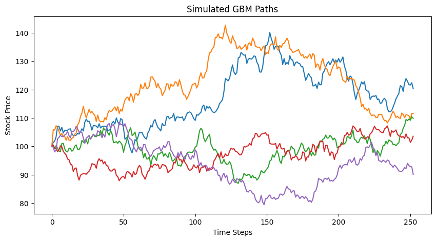
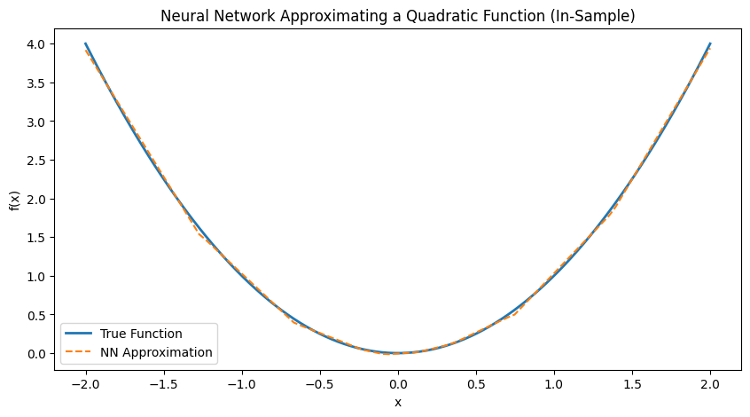
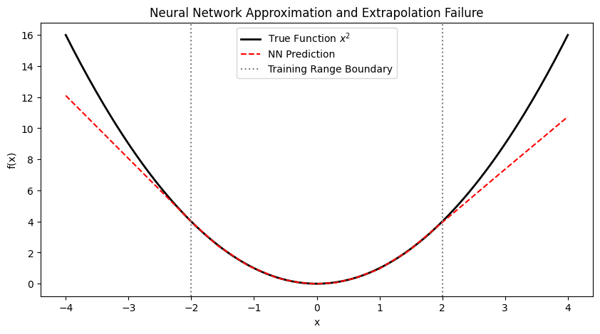
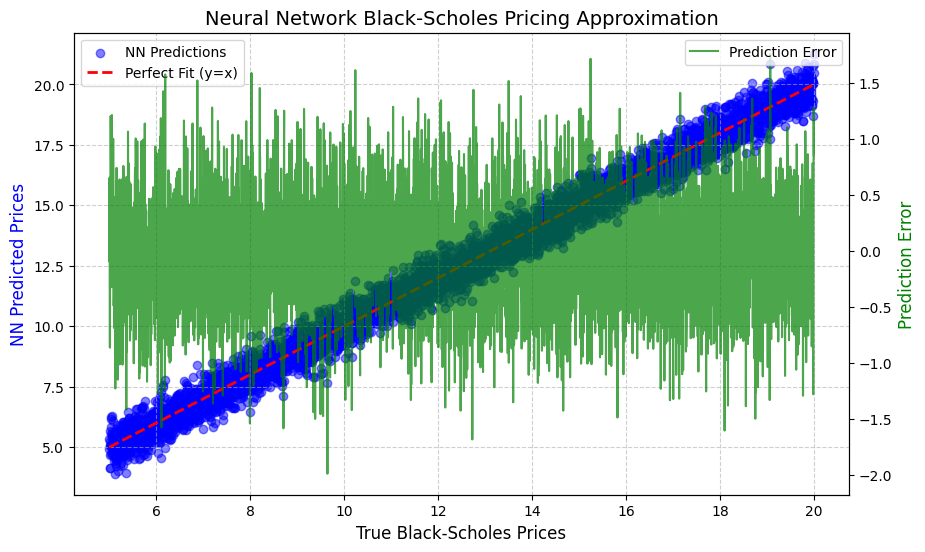
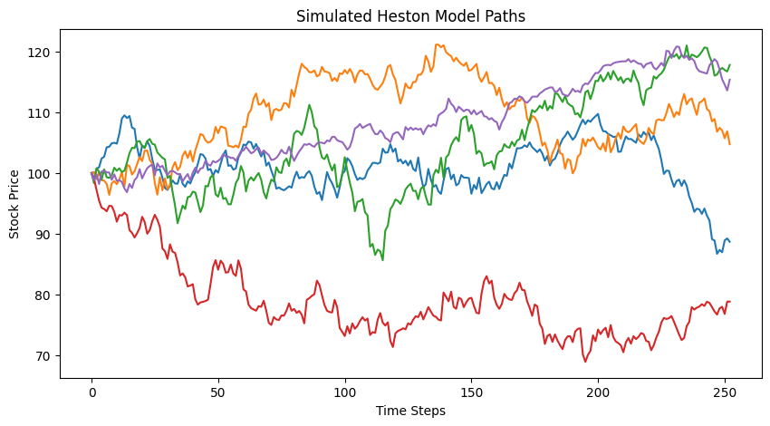
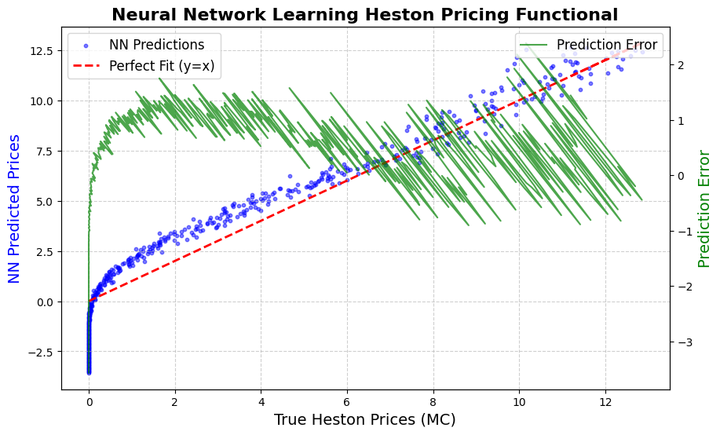

# Can AI Learn Black-Scholes? —— 用神经网络学习期权定价

> 本教材基于 Roman Paolucci 的教学视频 [Can AI Learn Black-Scholes?](https://www.youtube.com/watch?v=aRr3chiwkrI) 的内容整理而成，并配套了视频中的 Jupyter Notebook。该视频把**数据科学 / 机器学习 / 人工智能**与**金融数学**结合起来，探讨一个直击本质的问题：AI 能否学会 Black-Scholes？更一般地，AI 能否学会给期权定价？

---

## 1. 概述

本视频的核心思想非常简洁：

> **用神经网络去逼近 / 学习 Black-Scholes 期权定价函数**，并更进一步——用神经网络去学习那些**没有解析解**的更复杂模型（如 Heston 随机波动率模型）的"定价泛函"（pricing functional）。

关键脉络如下：

- **Black-Scholes 模型本质上是一个函数**：输入五个参数（标的资产价格 S、执行价 K、到期时间 T、无风险利率 r、波动率 σ），输出一个期权价格。
- **这些假设在实践中并不成立**：存在交易成本、偶尔的套利、无法连续对冲、波动率不恒定、价格会跳变……
- **更复杂的模型能捕捉更多市场动态，但往往没有解析解**，只能通过蒙特卡洛模拟来定价，而模拟在实时环境下太慢。
- **文献给出的思路是"离线做重活，在线用网络"**：离线（offline）大量模拟生成训练数据，训练一个神经网络去学习"参数 → 价格"的映射；上线后神经网络就能像 Black-Scholes 一样，瞬间输入参数、输出价格。

> 一句话：**把"复杂模型的定价"这个重计算问题，离线变成一次训练，在线变成一次前向传播。**

---

## 2. 为什么这个话题值得研究：模型复杂度与效率的权衡

### 2.1 Black-Scholes 的假设与其现实缺陷

我们可以为 Black-Scholes 定价建立完整的论证：

- 假设标的资产服从**几何布朗运动（Geometric Brownian Motion, GBM）**
- 波动率恒定、无套利、无交易成本、具备连续对冲能力

在这些假设下，我们可以用伊藤引理（Ito's lemma）推导 Black-Scholes 方程、求解这个偏微分方程，从而对欧式看涨 / 看跌期权生成价格。

问题在于：**这些假设在实践中全部被违反**。现实世界存在交易成本、套利、无法连续对冲、波动率不恒定、价格跳变等。

### 2.2 一个隐含的权衡（Tradeoff）

| 模型类型 | 典型例子 | 解析可解性 | 计算代价 |
|---------|---------|-----------|---------|
| 简约高效 | Black-Scholes | 解析解（闭式） | 极快 |
| 更复杂 | Heston（随机波动率） | 无闭式解（除 FFT 等技巧） | 需要模拟 |
| 更复杂 | 粗糙波动率（rough volatility） | 无解析解 | 需要模拟、更慢 |

> **模型越复杂，越难以解析求解，越需要模拟或更昂贵的数值方法来生成价格。**

### 2.3 为什么模拟在实时场景下"算不过来"

假设我们要把某个模型拟合到**市场波动率曲面（volatility surface）**上：

1. 首先需要把模型校准（calibrate）到曲面上——这需要一个优化方案（optimization scheme），并在每一步都生成价格。
2. 模拟存在**相对误差（relative error）**，而且不可能一两次模拟就拟合好曲面，需要反复运行大量路径。
3. 实时环境中我们往往要给**非常大量的金融工具**定价——这一整套流程在计算上是不可行的。

正是这种"实时计算瓶颈"，催生了用神经网络离线学习定价函数的研究思路。

---

## 3. 两种定价工具：解析解 vs 数值模拟

### 3.1 工具一：解析解（Black-Scholes 闭式公式）

Black-Scholes 模型是 Black-Scholes 方程的解，是一个 **R⁵ → R** 的映射：给我五个输入，我给你一个价格。

$$ C(S_0, K, T, r, \sigma) = S_0 N(d_1) - K e^{-rT} N(d_2) $$

$$ d_1 = \frac{\ln(S_0/K) + (r + \sigma^2/2)T}{\sigma \sqrt{T}}, \qquad d_2 = d_1 - \sigma \sqrt{T} $$

其中 $N(\cdot)$ 是标准正态分布的累积分布函数。

下面用 Python 实现该公式（本代码来自配套 Jupyter Notebook）：

```python
import numpy as np
import scipy.stats as si

def black_scholes_call(S, K, T, r, sigma):
    d1 = (np.log(S / K) + (r + 0.5 * sigma ** 2) * T) / (sigma * np.sqrt(T))
    d2 = d1 - sigma * np.sqrt(T)

    call_price = S * si.norm.cdf(d1) - K * np.exp(-r * T) * si.norm.cdf(d2)
    return call_price

# Example usage
S, K, T, r, sigma = 100, 100, 1, 0.05, 0.2
black_scholes_call(S, K, T, r, sigma)
```

### 3.2 工具二：数值模拟（蒙特卡洛）

数值模拟的方式是：**模拟标的资产的价格路径 → 计算期权收益 → 贴现回当前时刻 → 取平均值**。在风险中性测度下：

$$ \tilde{f}: \mathbb{R}^5 \to \mathbb{R}, \quad \mathbf{x} \mapsto \mathbb{E}[e^{-rT} \max(S_T - K, 0)] $$

对 GBM 进行离散化模拟并定价（本代码来自配套 Jupyter Notebook）：

```python
import matplotlib.pyplot as plt

def simulate_gbm(S0, T, r, sigma, steps, n_paths):
    dt = T / steps
    paths = np.zeros((steps + 1, n_paths))
    paths[0] = S0

    for t in range(1, steps + 1):
        Z = np.random.standard_normal(n_paths)
        paths[t] = paths[t - 1] * np.exp((r - 0.5 * sigma ** 2) * dt + sigma * np.sqrt(dt) * Z)

    return paths

# Parameters
S0, T, r, sigma, steps, n_paths = 100, 1, 0.05, 0.2, 252, 10000
gbm_paths = simulate_gbm(S0, T, r, sigma, steps, n_paths)

# Compute European Call option price using Monte Carlo
K = 100
payoffs = np.maximum(gbm_paths[-1] - K, 0)
mc_price = np.exp(-r * T) * np.mean(payoffs)

# Plot a few simulated paths
plt.figure(figsize=(10, 5))
plt.plot(gbm_paths[:, :5])
plt.xlabel("Time Steps")
plt.ylabel("Stock Price")
plt.title("Simulated GBM Paths")
plt.show()

print('Parameter Set:', S0, T, r, sigma, steps, n_paths)
mc_price
```

下图展示了模拟出的 GBM 价格路径：



> **关键观察**：对相同的参数集，模拟定价与 Black-Scholes 解析价格非常接近——这不是巧合。但既然 GBM 正是 Black-Scholes 的假设，直接代入公式得到精确价格即可，模拟在这里"派不上用场"。模拟的价值在于：**对没有解析解的模型**，它是唯一可行的定价手段。

---

## 4. 神经网络入门：从"学习一个二次函数"说起

如果神经网络连最简单的函数都能学会，那么学习 Black-Scholes 这种"参数 → 价格"的解析函数，本质上并无不同。

> **f(x) = x²** 是一个输入、一个输出；**Black-Scholes** 是五个输入、一个输出——功能上完全等价，只是维度更高、更难可视化。

### 4.1 样本内（In-Sample）：学习抛物线

我们在 x ∈ [-2, 2] 上采样 100 个点，构造输入-输出对，训练一个两层全连接神经网络（本代码来自配套 Jupyter Notebook）：

```python
import torch
import torch.nn as nn
import torch.optim as optim

# Generate training data
x_train = np.linspace(-2, 2, 100).reshape(-1, 1)
y_train = x_train**2

x_train_tensor = torch.tensor(x_train, dtype=torch.float32)
y_train_tensor = torch.tensor(y_train, dtype=torch.float32)

# Define neural network
class SimpleNN(nn.Module):
    def __init__(self):
        super(SimpleNN, self).__init__()
        self.fc1 = nn.Linear(1, 10)
        self.fc2 = nn.Linear(10, 10)
        self.fc3 = nn.Linear(10, 1)
        self.relu = nn.ReLU()

    def forward(self, x):
        x = self.relu(self.fc1(x))
        x = self.relu(self.fc2(x))
        return self.fc3(x)

model = SimpleNN()
criterion = nn.MSELoss()
optimizer = optim.Adam(model.parameters(), lr=0.01)

# Train model
epochs = 1000
for epoch in range(epochs):
    optimizer.zero_grad()
    outputs = model(x_train_tensor)
    loss = criterion(outputs, y_train_tensor)
    loss.backward()
    optimizer.step()

# Plot results
y_pred = model(x_train_tensor).detach().numpy()

plt.figure(figsize=(10, 5))
plt.plot(x_train, y_train, label="True Function", linewidth=2)
plt.plot(x_train, y_pred, label="NN Approximation", linestyle="dashed")
plt.xlabel("x")
plt.ylabel("f(x)")
plt.title("Neural Network Approximating a Quadratic Function (In-Sample)")
plt.legend()
plt.show()
```

样本内拟合效果非常好——这是神经网络作为**通用函数逼近器（Universal Function Approximator）**的直接体现：



### 4.2 样本外（Out-of-Sample）：外推失败

把测试范围扩展到 x ∈ [-4, 4]，看它在训练范围之外的表现：



> **样本外外推表现很差。** 图上的两条竖线是训练数据的分界点；一旦离开训练范围，神经网络基本无法外推。这正是 AI 的普遍弱点。我们可以通过不同的网络结构、正则化等手段改善外推，但必须始终意识到这一点。

> **启示**：如果我们要用神经网络给期权定价，训练参数的范围（domain）必须覆盖实际会用到的参数区间，并对外推保持警惕。

---

## 5. 关键记法：三条等价的价格曲线

视频给出了贯穿全文的核心记法（本代码来自配套 Jupyter Notebook 的 markdown 单元格）：

$$ \text{Analytical Price} \approx \text{Numerical Price} \approx \text{Neural Network Numerical Price} $$

$$ C(\cdot) \approx \tilde{C}(\cdot) \approx \tilde{\tilde{C}}(\cdot) $$

| 记号 | 含义 | 说明 |
|------|------|------|
| $C(\cdot)$ | 解析价格 | Black-Scholes 闭式解，五个参数直接映射到价格 |
| $\tilde{C}(\cdot)$ | 数值 / 模拟价格 | 蒙特卡洛模拟，同样接受五个参数，输出期望收益的贴现 |
| $\tilde{\tilde{C}}(\cdot)$ | 神经网络近似价格 | 学习"参数 → 模拟价格"映射的神经网络 |

三个映射都是 **R⁵ → R**。视频反复强调：

- 解析解 $C$：你给参数，我输出**真实价格**。
- 蒙特卡洛近似 $\tilde{f}$：你给参数，我输出**近似价格**（期望收益的贴现）。
- 神经网络 $f_\theta$：学习 $\tilde{f}$ 的映射，训练后**在实时场景瞬间输出价格**。

> 若神经网络近似误差收敛到 0（存在相关定理支持），三者便趋于等价。神经网络 $f_\theta$ 的优势在于：**它的输入维度可以是任意参数集的维度（θ 的维度），不限于五维**。

---

## 6. 用神经网络学习 Black-Scholes 价格

### 6.1 生成训练数据

思路与二次函数完全一致：生成大量"参数 → 价格"的样本对，让神经网络去学。

- 生成 **5,000 组**参数集（输入），每组五个参数：S, K, T, r, σ
- 用 Black-Scholes 闭式公式计算出 **5,000 个**期权价格（输出）

训练数据生成 + 网络定义（本代码来自配套 Jupyter Notebook）：

```python
import numpy as np
import torch
import torch.nn as nn
import torch.optim as optim
from scipy.stats import norm

# Black-Scholes closed-form solution
def black_scholes_call(S, K, T, r, sigma):
    d1 = (np.log(S / K) + (r + 0.5 * sigma ** 2) * T) / (sigma * np.sqrt(T))
    d2 = d1 - sigma * np.sqrt(T)

    return S * norm.cdf(d1) - K * np.exp(-r * T) * norm.cdf(d2)

# Generate Black-Scholes dataset
n_samples = 5000
S_range = np.linspace(80, 120, n_samples)
K_range = np.full(n_samples, 100)
T_range = np.linspace(0.1, 2, n_samples)
r_range = np.full(n_samples, 0.05)
sigma_range = np.linspace(0.1, 0.5, n_samples)

# Stack parameters as input vectors
inputs = np.vstack([S_range, K_range, T_range, r_range, sigma_range]).T
outputs = np.array([black_scholes_call(S, K, T, r, sigma) for S, K, T, r, sigma in inputs])

# Convert to tensors
inputs_tensor = torch.tensor(inputs, dtype=torch.float32)
outputs_tensor = torch.tensor(outputs.reshape(-1, 1), dtype=torch.float32)

# Define improved neural network
class BlackScholesNN(nn.Module):
    def __init__(self):
        super(BlackScholesNN, self).__init__()
        self.fc1 = nn.Linear(5, 32)
        self.fc2 = nn.Linear(32, 32)
        self.fc3 = nn.Linear(32, 1)
        self.relu = nn.ReLU()

    def forward(self, x):
        x = self.relu(self.fc1(x))
        x = self.relu(self.fc2(x))
        return self.fc3(x)

# Initialize and train the model
model = BlackScholesNN()
criterion = nn.MSELoss()
optimizer = optim.Adam(model.parameters(), lr=0.001)

epochs = 5000
for epoch in range(epochs):
    optimizer.zero_grad()
    preds = model(inputs_tensor)
    loss = criterion(preds, outputs_tensor)
    loss.backward()
    optimizer.step()
```

### 6.2 训练与结果

训练完成后，随机抽取参数集对比**真实价格**与**神经网络预测**。视频中展示了几组结果（例如第 3,817 组参数：真实价格约 3.04，预测约 3.07），并指出某些预测会出现**负值**——期权内在价值不可能为负，因此实际应用中需要对输出做约束（bound）。总体而言误差并不大：

> **可以合理地认为：神经网络正在学习 Black-Scholes。** 增加训练容量（如把 epoch 从 1,000 提到 5,000）会得到越来越精确的价格。

下面的散点图展示了神经网络预测价格 vs 真实 Black-Scholes 价格（红色虚线为完美拟合 y=x），绿色曲线为随样本排列的预测误差：



---

## 7. 推广到随机波动率模型：Heston

Black-Scholes 假设恒定波动率，无法捕捉波动率聚集等市场行为。**Heston 模型**引入了随机波动率：

$$ dS_t = \mu S_t dt + \sqrt{V_t} S_t dW_t^S $$

$$ dV_t = \kappa (\theta - V_t) dt + \xi \sqrt{V_t} dW_t^V $$

其中 $S_t$ 是资产价格，$V_t$ 是随机方差，$\kappa$ 是均值回归速度，$\theta$ 是长期方差，$\xi$ 是方差的波动率，$W_t^S$ 与 $W_t^V$ 是相关系数为 $\rho$ 的维纳过程。

- Heston 模型通常**没有闭式解**（除非用 FFT 等技巧），因此需要**模拟**来定价。
- 用 Euler-Maruyama 方案离散化并模拟路径（本代码来自配套 Jupyter Notebook）：

```python
def simulate_heston(S0, V0, T, r, kappa, theta, xi, rho, steps, n_paths):
    dt = T / steps
    S = np.zeros((steps + 1, n_paths))
    V = np.zeros((steps + 1, n_paths))
    S[0], V[0] = S0, V0

    for t in range(1, steps + 1):
        Z_S = np.random.standard_normal(n_paths)
        Z_V = rho * Z_S + np.sqrt(1 - rho**2) * np.random.standard_normal(n_paths)

        V_t = np.maximum(V[t-1] + kappa * (theta - V[t-1]) * dt + xi * np.sqrt(V[t-1] * dt) * Z_V, 0)
        S_t = S[t-1] * np.exp((r - 0.5 * V[t-1]) * dt + np.sqrt(V[t-1] * dt) * Z_S)

        S[t] = S_t
        V[t] = V_t

    return S, V

# Parameters
S0, V0, T, r = 100, 0.04, 1, 0.05
kappa, theta, xi, rho = 2.0, 0.04, 0.3, -0.7
steps, n_paths = 252, 10000

# Simulate Heston paths
S_paths, V_paths = simulate_heston(S0, V0, T, r, kappa, theta, xi, rho, steps, n_paths)

# Plot example paths
plt.figure(figsize=(10, 5))
plt.plot(S_paths[:, :5])
plt.xlabel("Time Steps")
plt.ylabel("Stock Price")
plt.title("Simulated Heston Model Paths")
plt.show()
```



### 7.1 Heston 定价数据集与神经网络

既然 Heston 没有解析解，我们用蒙特卡洛模拟生成训练数据：

- **输入**（8 维）：$(S_0, V_0, T, r, \kappa, \theta, \xi, \rho)$
- **输出**：蒙特卡洛估计的价格（模拟路径收益的平均贴现）

> 注意：Heston 的参数集是**八维**的（Black-Scholes 只有五维）。这正是神经网络的优势——**输入维度可以随模型而定**，不局限于五维。

生成数据集并训练网络（本代码来自配套 Jupyter Notebook）：

```python
import numpy as np
import torch
import torch.nn as nn
import torch.optim as optim

# Generate synthetic dataset
n_samples = 1000
S0_range = np.linspace(80, 120, n_samples)
V0_range = np.linspace(0.01, 0.1, n_samples)
T_range = np.linspace(0.1, 2, n_samples)
kappa_range = np.linspace(1, 5, n_samples)
theta_range = np.linspace(0.02, 0.1, n_samples)
xi_range = np.linspace(0.1, 0.5, n_samples)
rho_range = np.linspace(-0.9, 0.9, n_samples)
r_range = np.full(n_samples, 0.05)

inputs = np.vstack([S0_range, V0_range, T_range, kappa_range, theta_range, xi_range, rho_range, r_range]).T
outputs = []

for i in range(n_samples):
    S_paths, _ = simulate_heston(S0_range[i], V0_range[i], T_range[i], r_range[i],
                                 kappa_range[i], theta_range[i], xi_range[i], rho_range[i],
                                 steps=50, n_paths=500)

    payoffs = np.maximum(S_paths[-1] - 100, 0)  # European call option payoff
    option_price = np.exp(-r_range[i] * T_range[i]) * np.mean(payoffs)
    outputs.append(option_price)

outputs = np.array(outputs)

# Convert to tensors
inputs_tensor = torch.tensor(inputs, dtype=torch.float32)
outputs_tensor = torch.tensor(outputs.reshape(-1, 1), dtype=torch.float32)

# Define a neural network model
class HestonNN(nn.Module):
    def __init__(self):
        super(HestonNN, self).__init__()
        self.fc1 = nn.Linear(8, 32)
        self.fc2 = nn.Linear(32, 32)
        self.fc3 = nn.Linear(32, 1)
        self.relu = nn.ReLU()

    def forward(self, x):
        x = self.relu(self.fc1(x))
        x = self.relu(self.fc2(x))
        return self.fc3(x)

# Initialize and train the model
model = HestonNN()
criterion = nn.MSELoss()
optimizer = optim.Adam(model.parameters(), lr=0.001)

epochs = 1000
for epoch in range(epochs):
    optimizer.zero_grad()
    preds = model(inputs_tensor)
    loss = criterion(preds, outputs_tensor)
    loss.backward()
    optimizer.step()

# Compare true and predicted prices
preds_np = model(inputs_tensor).detach().numpy()
```

### 7.2 结果与误差分析

训练后的预测对比如下（红色虚线为完美拟合 y=x，绿色曲线为预测误差）：



> **误差分析**：本例的预测误差偏大，原因在于演示中只用了 **1,000 个 epoch**、每个参数集只模拟了 **500 条路径**。若追求更高的精度 / 准确性，只需调高这些数字（更多路径、更多 epoch）。这类误差在文献中被研究得很透彻，可以很容易地做统计与置信区间分析。

---

## 8. 局限性与启示

### 8.1 局限性

1. **外推（extrapolation）能力差**：与二次函数例子一致，神经网络在训练参数范围之外表现不佳。参数空间必须覆盖实际定价所需的范围。
2. **参数空间受限**：视频演示中，参数集是相当受限的（如固定执行价 K=100、固定无风险利率 r=0.05）。真实应用需要对这些参数生成大量排列组合（permutation）。
3. **近似误差**：你不可能"不劳而获"——换取实时速度的代价是相对误差。误差可被统计刻画、约束，但始终存在。
4. **预测可能不合理**：神经网络可能输出负的价格（期权价格不可能为负），需要加约束 / 后处理。

### 8.2 启示

- **离线做重活，在线用网络**：这是整条文献线的核心——把所有繁重的模拟放在离线、不受时间约束时完成，把训练好的神经网络变成一个"即插即用"的确定性函数，在实时环境中瞬间输出价格。
- **一鱼两吃**：在保持所捕捉的动态特性的同时提高效率。只要误差可约束，这就是一个非常有吸引力的方案。
- **可扩展性**：对于大量需要定价的金融工具，神经网络的高效性使得那些原本"计算上不可行"的模型变得可用。

---

## 9. 关键概念总结

| 概念 | 中文 | 要点 |
|------|------|------|
| **Black-Scholes 模型** | Black-Scholes 定价公式 | 解析函数：五个参数（S, K, T, r, σ）→ 一个价格 |
| **解析解 vs 数值解** | Analytical vs Numerical | 前者闭式、瞬间；后者蒙特卡洛模拟、实时太慢 |
| **Volatility Surface** | 波动率曲面 | 复杂模型上线前需校准到市场曲面，这是计算瓶颈 |
| **Pricing Functional** | 定价泛函 | 从参数集到价格的函数映射（可能是 R⁵、R⁸ 等高维） |
| **Universal Approximation** | 通用函数逼近 | 神经网络可逼近任意连续函数，故能学习定价函数 |
| **Extrapolation** | 外推 | 神经网络在训练范围之外表现差，参数范围需覆盖实际区间 |
| **In-Sample / Out-of-Sample** | 样本内 / 样本外 | 样本内拟合好；样本外（外推）是主要失败点 |
| **Monte Carlo Simulation** | 蒙特卡洛模拟 | 模拟路径 → 计算收益 → 贴现取平均；路径越多越准 |
| **C(·) ≈ C̃(·) ≈ C̃̃(·)** | 三价格近似 | 解析 ≈ 数值 ≈ 神经网络数值 |
| **Offline / Online** | 离线 / 在线 | 离线训练网络，在线瞬间定价 |

---

## 10. 关键要点

1. **AI 确实可以学会 Black-Scholes**：前馈神经网络（feedforward network）能近似 Black-Scholes 价格。
2. **原理是通用函数逼近定理**：神经网络能学习任何连续函数，因此天然适合学习定价函数。
3. **更一般地，AI 能学"期权定价"**：对没有解析解的模型（如 Heston 随机波动率模型），用模拟生成训练数据，再训练网络近似定价泛函（参考 Horvath et al.、Hull et al. 等文献）。
4. **权衡不变**：以近似误差换取实时计算效率；"离线做重活，在线用网络"。
5. **注意外推与约束**：训练参数范围须覆盖实际需求；预测价格需约束为非负。

### 一句话总结

> **把"参数 → 价格"的定价函数看作一个可以学习的映射，离线用模拟把重活干完，再用神经网络把这个"Black-Scholes 式"的解析输入-输出搬到实时环境中——这就是用 AI 学习期权定价的本质。**

---

## 11. 延伸阅读

- 视频配套 Jupyter Notebook：[Can AI Learn Black-Scholes.ipynb](https://github.com/romanmichaelpaolucci/Quant-Guild-Library/blob/main/2025%20Video%20Lectures/13.%20Can%20AI%20Learn%20Black-Scholes/Can%20AI%20Learn%20Black-Scholes.ipynb)
- [Trading with the Black-Scholes Model](https://www.youtube.com/watch?v=0x-Pc-Z3wu4)
- [Black-Scholes Equation Derivation](https://www.youtube.com/watch?v=2iClLEfXuqA) 与 [Deriving the Black-Scholes Model](https://medium.com/swlh/deriving-the-black-scholes-model-5e518c65d0bc)
- [European Options 101](https://www.youtube.com/watch?v=HgjeDJVCHSo)
- [Market Implied Volatility](https://www.youtube.com/watch?v=VzieTIsBaHM)
- [Quant Guild 官网](https://quantguild.com)
- [Quant Guild 博客](https://medium.com/quant-guild)
- [Quant Guild GitHub](https://github.com/Quant-Guild)
- [Quant Guild Discord](https://discord.com/invite/MJ4FU2c6c3)

---

*本教材由 Roman Paolucci 的教学视频 [Can AI Learn Black-Scholes?](https://www.youtube.com/watch?v=aRr3chiwkrI) 整理而成。*
