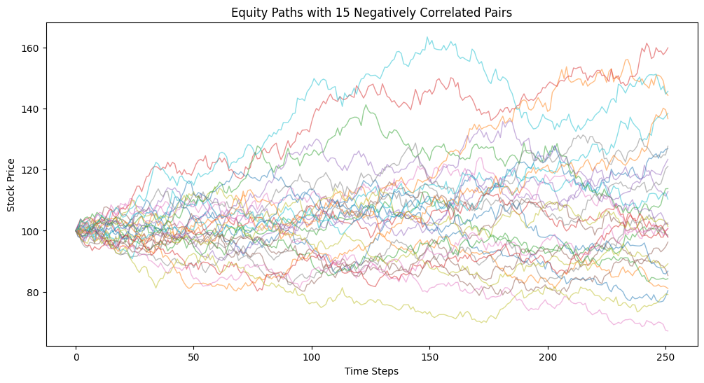
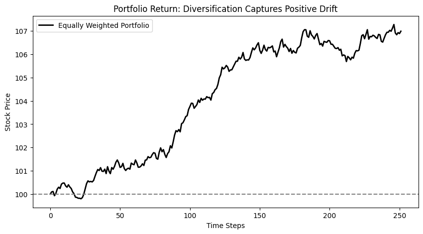
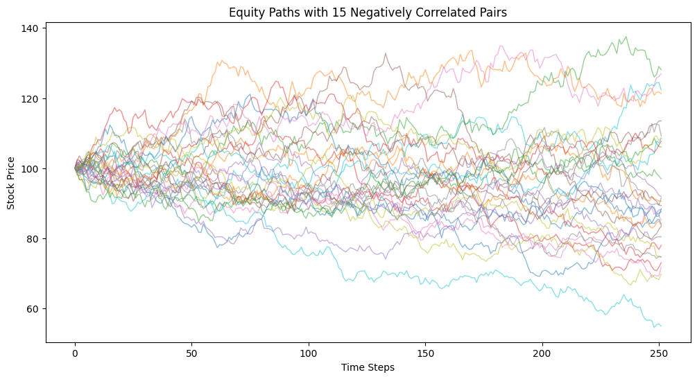
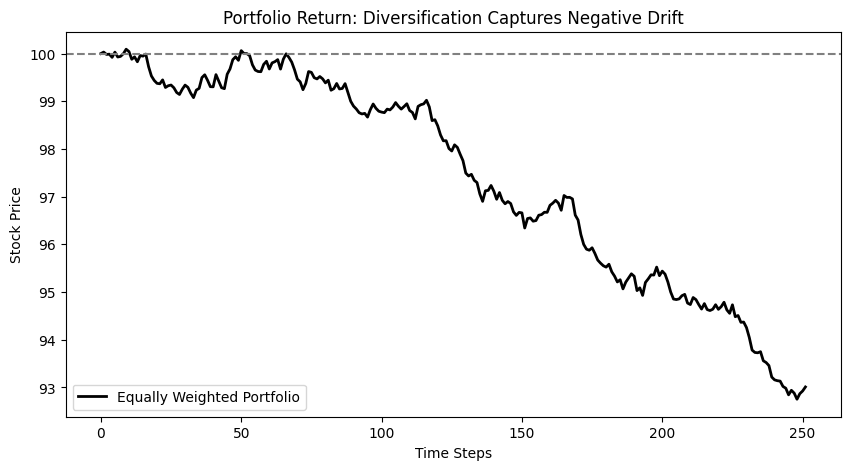
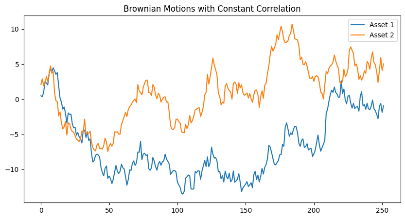
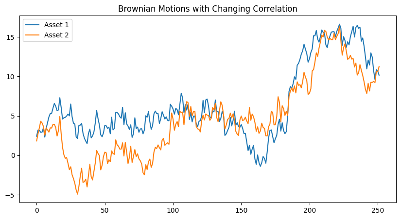
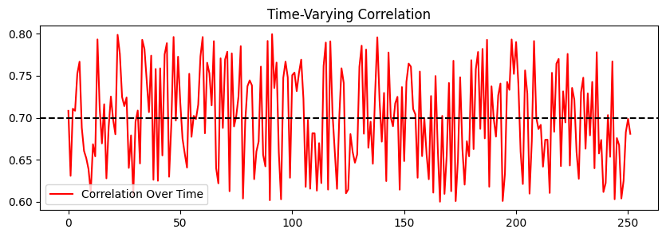
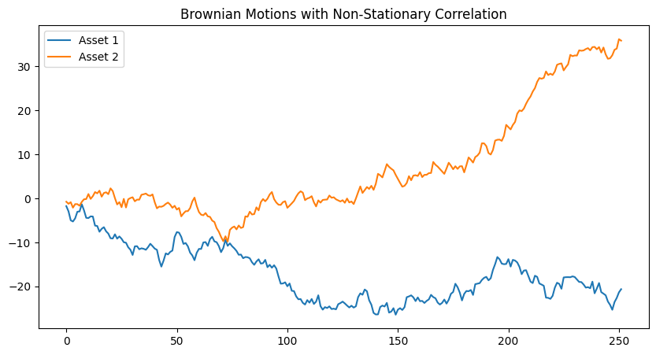
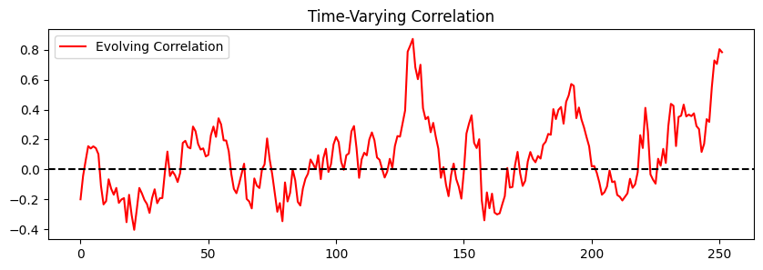

# Quant Investing for Beginners（初学者量化投资策略）

> 本教材基于 Roman Paolucci 的教学视频 [Quant Investing for Beginners](https://www.youtube.com/watch?v=aBfkf_0YsCY) 的内容整理而成。视频面向初学者，讲解量化投资（Quantitative Investing）背后的金融数学：从投资组合风险的分类、分散化的原理，到相关性（correlation）在选股与再平衡中的作用。配套 Jupyter Notebook 可在视频简介的 GitHub 链接中获取，代码文件即视频同款的"等权组合分散化 + 时变相关性"模拟。

---

## 1. 概述

本视频的核心思想非常朴素却重要：**不要试图选股，而是通过分散化（diversification）把"可以被分散掉的风险"去掉，只保留"无法被分散的市场风险"，从而长期积累市场的正收益漂移（positive drift）。**

具体来说，视频通过三步层层推进：

1. **认识风险**：把股票组合的风险拆成三类——特异风险、行业风险、市场风险。
2. **分散化**：用"30 只股票等权组合"的蒙特卡洛模拟，证明等权组合可以抹平前两类风险，只留下市场风险。
3. **相关性**：通过模拟与现实数据（Portfolio Visualizer）说明"相关性是一个会随时间变化的统计量"，选股与再平衡都必须把这个因素纳入考虑。

> 核心思想：**量化投资 ≠ 高频/选股式量化交易**。它更接近"用数学理解并管理风险、稳健地积累市场收益"的过程。

---

## 2. 量化交易与量化投资：两回事

| 维度 | 量化交易（Quantitative Trading） | 量化投资（Quantitative Investing） |
|------|----------------------------------|--------------------------------------|
| 数据 | 大量另类数据（alternative data） | 以公开价格/基本面为主 |
| 频率 | 低延迟（low latency）、大量交易 | 中低频，按计划再平衡 |
| 目标 | 在横截面上预测收益、捕捉微观 alpha | 管理风险敞口、积累市场长期收益 |
| 哲学 | 追求战胜市场 | 赚取市场本身的收益，不追求"疯狂的下注" |

视频明确说明：**本视频不告诉你看好哪只股票**，而是让你理解——当你以任何方式参与市场时，背后到底发生了什么（underlying financial mathematics）。

---

## 3. 投资组合风险的三大类别

视频把股票组合的风险"拉远视角"后归为三个桶（bucket）：

1. **特异风险（Idiosyncratic Risk / Firm-Specific Risk）**：与单个公司相关的风险。例如持有苹果（Apple），风险来自该公司的经营、产品、管理层。**可通过持有多只股票分散掉。**
2. **行业风险（Industry Risk / Sector Risk）**：与整个行业相关的风险，如整个医疗、整个科技、整个公用事业。例如监管（regulatory risk）可能冲击一个行业整体。**可通过跨行业分散降低。**
3. **市场风险（Market Risk / Systematic Risk）**：影响整个市场的风险，如 GDP、通胀、利率等宏观因素。**无法通过分散化消除。**

> **为什么要关心这三类风险？** 因为"要想获得收益就必须承担风险，但不必承担不必要的风险"。量化的思路就是：**把能被分散掉的风险（前两类）去掉，只保留必须承担的市场风险。**

举个极端例子：把整个退休账户都买成英伟达（Nvidia）一只股票，等于同时暴露在特异风险、行业风险和市场风险之中——而且这些风险**并非平均分配**。如果科技行业或英伟达本身表现不佳、或新技术反超它，你将亏掉一大笔钱。这本质上变成了一场"选股游戏"（stock picking），不是我们要的策略。

> 提示：即使你想用历史数据近似这种风险，也要记住"历史数据不能预示未来表现"（historical data is not indicative of future performance）。

---

## 4. 分散化策略：只留下市场风险

我们的目标不是**完全消除风险**（那等于买入美国国债，赚取无风险利率，风险收益曲线就平了），而是：

```
保留：市场风险敞口（Market Risk Exposure）
消除：特异风险（Idiosyncratic Risk）+ 行业风险（Industry Risk）
```

> **需要注意**：即便通过分散化只保留市场风险，**也不保证一定赚钱**——只有市场漂移为正时，长期积累才会产生财富。这正是"下注美国经济"的逻辑。

### 4.1 用蒙特卡洛模拟验证分散化

视频配套的 Jupyter Notebook 用**几何布朗运动（GBM）**模拟股票价格路径：

- 30 只股票，两两配成 15 对负相关（correlation coefficient $\rho=-0.7$）的资产对；
- 每只股票起始价格 $S_0=100$，预期年化漂移 $\mu$（先看 $+7\%$），年化波动率 $\sigma=20\%$；
- 时间步长按日计：$T=252$ 个交易日（一年）。

**本代码来自配套 Jupyter Notebook（第一个单元格）：**

```python
import numpy as np
import matplotlib.pyplot as plt

# Simulation parameters
T = 252  # Number of trading days (1 year)
N_pairs = 15  # Number of negatively correlated pairs (total assets will be 2 * N_pairs)
N_assets = 2 * N_pairs
dt = 1 / 252  # Time step (daily)
mu = 0.07  # Expected annual return (drift)
sigma = 0.2  # Volatility (20% annualized)
rho = -0.7  # Desired correlation between asset pairs

# Initialize GBM paths
S0 = 100  # Initial stock price
S = np.zeros((N_assets, T))
S[:, 0] = S0

# Generate and simulate GBMs for 15 correlated pairs
for i in range(N_pairs):
    # Generate correlated Brownian motions for each pair
    dW1 = np.random.normal(0, np.sqrt(dt), T)  # First Brownian motion
    dW2 = rho * dW1 + np.sqrt(1 - rho**2) * np.random.normal(0, np.sqrt(dt), T)  # Second Brownian motion (negatively correlated)

    # Simulate GBM for both assets in the pair
    for t in range(1, T):
        S[2 * i, t] = S[2 * i, t - 1] * np.exp((mu - 0.5 * sigma**2) * dt + sigma * dW1[t])
        S[2 * i + 1, t] = S[2 * i + 1, t - 1] * np.exp((mu - 0.5 * sigma**2) * dt + sigma * dW2[t])

# Plot individual GBM paths
plt.figure(figsize=(12, 6))
for i in range(N_assets):
    plt.plot(S[i], alpha=0.5, lw=1)

plt.title("Equity Paths with 15 Negatively Correlated Pairs")
plt.xlabel("Time Steps")
plt.ylabel("Stock Price")
plt.show()
```

### 4.2 正漂移市场：单只股票参差不齐

模拟结果展示了分散化的直觉来源——**单只股票的终值非常随机**：



- 平均而言每只股票的漂移是 $7\%$，起点都是 $100$；
- 但**并非每只股票都收在 $107$**——有些收得远高于它，有些远低于它；
- 我们不知道任何一只股票会落在哪里，**但我们知道模拟里写入的平均收益是 $7\%$**；
- 这个 $7\%$ 可以被理解为"市场收益"（market return）：市场好的年份期望有正收益。

---

## 5. 策略模拟回测一：等权组合捕捉正漂移

既然单只股票太随机，我们就把 30 只股票做**等权组合（equally weighted portfolio）**——即把 $30{,}000$ 美元平均分成 30 份，每只股票投入 $1{,}000$ 美元。等权组合的净值就是所有股票路径的简单平均。

**本代码来自配套 Jupyter Notebook（第二个单元格）：**

```python
# Compute the equally weighted portfolio by averaging all asset paths
portfolio = np.mean(S, axis=0)

# Plot the portfolio return
plt.figure(figsize=(10, 5))
plt.plot(portfolio, label="Equally Weighted Portfolio", color='black', lw=2)
plt.axhline(y=S0, color='gray', linestyle='--')
plt.title("Portfolio Return: Diversification Captures Positive Drift")
plt.xlabel("Time Steps")
plt.ylabel("Stock Price")
plt.legend()
plt.show()
```



关键观察：

- 组合净值曲线平滑地趋向 $7\%$ 的预期收益——**正好拿到我们预期的结果**；
- 表现最好的股票不能把组合抬得"像孤注一掷那么高"，表现最差的股票**也不能拖垮组合**；
- 我们实质上**分散买走了**（diversified away）行业与特异两类风险，只剩市场成分。

> 这就是"不选股、不疯狂下注"的量化投资：**只求积累财富，不求一夜暴富。**

---

## 6. 策略模拟回测二：负漂移市场（分散化不保证盈利）

视频特意给出"反面教材"：把漂移从 $\mu=+7\%$ 改成 $\mu=-7\%$（其余代码完全不变，即 Jupyter Notebook 的第三、四个单元格）。此时市场整体下行：



- 平均而言所有股票都围绕初始价格 $100$ 波动、产生负收益；
- 但仍有少数路径（绿色、橙色、蓝色、粉色）意外跑赢，甚至接近 $+20\%$；
- 等权组合取平均后，年底得到的正是大约 $-7\%$ 的收益。



**关键结论：** 分散化**消除了个股与行业的"运气"，却无法消除市场的"运气"**。只保留市场风险敞口并不保证平均赚钱——只有当市场漂移为正时，我们才能随时间积累这份财富。

> 历史恰恰如此——否则没人会愿意投资美股。这是"押注美国经济长期向上"的量化依据。

---

## 7. 相关性的作用：选股的关键

现在进入让这套策略成为"**量化**"的部分：**相关性（correlation）**。

> 大致原则：挑选**负相关或中性相关**的股票——一只上涨时另一只倾向于下跌或持平。这样组合的波动被对冲，同时仍能享受市场成分带来的正收益。

### 7.1 固定相关性（Constant Correlation）模拟

首先看一个"理想"的设定：把两资产相关性固定为 $\rho = 0.5$。

**本代码来自配套 Jupyter Notebook（第六个单元格）：**

```python
import numpy as np
import matplotlib.pyplot as plt

# Set random seed for reproducibility
np.random.seed(42)

# Simulation parameters
T = 252  # Number of trading days
dt = 1   # Time step
mu = 0.05  # Expected return
sigma = 0.2  # Volatility
rho_constant = 0.5  # Constant correlation

# Generate two correlated Brownian motions with constant correlation
dW1 = np.random.normal(0, np.sqrt(dt), T)
dW2 = rho_constant * dW1 + np.sqrt(1 - rho_constant**2) * np.random.normal(0, np.sqrt(dt), T)

S1 = np.cumsum(dW1)  # Asset 1 price movement
S2 = np.cumsum(dW2)  # Asset 2 price movement

# Plot
plt.figure(figsize=(10, 5))
plt.plot(S1, label="Asset 1")
plt.plot(S2, label="Asset 2")
plt.title("Brownian Motions with Constant Correlation")
plt.legend()
plt.show()
```



可以看到两条路径"如影随形"（看起来像彼此的印记）：一个资产上涨时，另一个以 $50\%$ 的比例跟着上涨。若相关性为负，两条线就互为镜像。

### 7.2 时变相关性：相关性不是常数

现实世界的问题在于：**股票之间的相关性不恒定**。视频用两组模拟展示相关性的两种演化方式。

**本代码来自配套 Jupyter Notebook（第七个单元格）：相关性在一个小区间内随机波动（平稳型）：**

```python
# Generate correlation that changes over time
rho_random = np.random.uniform(0.6, 0.8, T)

dW1 = np.random.normal(0, np.sqrt(dt), T)
dW2 = np.array([rho_random[t] * dW1[t] + np.sqrt(1 - rho_random[t]**2) * np.random.normal(0, np.sqrt(dt)) for t in range(T)])

S1_rand = np.cumsum(dW1)
S2_rand = np.cumsum(dW2)

# Plot
plt.figure(figsize=(10, 5))
plt.plot(S1_rand, label="Asset 1")
plt.plot(S2_rand, label="Asset 2")
plt.title("Brownian Motions with Changing Correlation")
plt.legend()
plt.show()

# Plot correlation over time
plt.figure(figsize=(10, 3))
plt.plot(rho_random, label="Correlation Over Time", color='red')
plt.axhline(y=.7, color='black', linestyle='--')
plt.title("Time-Varying Correlation")
plt.legend()
plt.show()
```





- 两资产的相关系数平均约为 $0.7$，但会在 $0.6 \sim 0.8$ 之间来回摆动（**平稳**，stationary）；
- 有些时期两条路径高度同步，有些时期则不那么同步。

**本代码来自配套 Jupyter Notebook（第八个单元格）：非平稳（non-stationary）的相关性——用 AR(1) 式过程让相关性自身也漂移：**

```python
import numpy as np
import matplotlib.pyplot as plt

# Set random seed for reproducibility
np.random.seed(42)

# Simulation parameters
T = 252  # Number of trading days
dt = 1   # Time step

# Generate a non-stationary correlation process using an AR(1)-like model
rho = np.zeros(T)
rho[0] = np.random.uniform(-0.8, 0.8)  # Initial correlation
alpha = 0.9  # Persistence factor (closer to 1 means smoother evolution)
shock_std = 0.1  # Standard deviation of random shocks

for t in range(1, T):
    rho[t] = alpha * rho[t-1] + (1 - alpha) * np.random.uniform(-0.8, 0.8) + np.random.normal(0, shock_std)
    rho[t] = np.clip(rho[t], -1, 1)  # Ensure correlation stays within [-1, 1]

# Generate Brownian motions with evolving correlation
dW1 = np.random.normal(0, np.sqrt(dt), T)
dW2 = np.zeros(T)

for t in range(T):
    dW2[t] = rho[t] * dW1[t] + np.sqrt(1 - rho[t]**2) * np.random.normal(0, np.sqrt(dt))

# Compute asset price paths
S1_evolving = np.cumsum(dW1)
S2_evolving = np.cumsum(dW2)

# Plot asset price movements
plt.figure(figsize=(10, 5))
plt.plot(S1_evolving, label="Asset 1")
plt.plot(S2_evolving, label="Asset 2")
plt.title("Brownian Motions with Non-Stationary Correlation")
plt.legend()
plt.show()

# Plot correlation evolution over time
plt.figure(figsize=(10, 3))
plt.plot(rho, label="Evolving Correlation", color='red')
plt.axhline(y=0, color='black', linestyle='--')
plt.title("Time-Varying Correlation")
plt.legend()
plt.show()
```





这里有一个反直觉的现象：资产一的路径与资产二**越漂越远**，但相关系数本身却在上升——因为它衡量的是"波动的同步性"而非"水平是否一致"。**相关性绝不围绕某个中心值稳定，而是每天都在变。**

### 7.3 相关性的窗口问题

相关系数的值**取决于你用什么窗口计算**：

- 用日收益、月收益、年收益计算，结果完全不同；
- 用 12 个月滚动、60 天滚动、20 天滚动计算，平滑度与数值也不同；
- 因此，**"相关性是多少"没有唯一答案，必须说明计算窗口**。

> 这是让策略成为"量化"的真正原因：**你必须持续关注组合内股票相关性的演变，而不是假设它恒定。**

---

## 8. 现实世界中的相关性：Portfolio Visualizer 实证

视频用 [Portfolio Visualizer](https://www.portfoliovisualizer.com/) 的相关性工具验证了上述观点。

### 8.1 看似无关的两只股票：强生 vs Chipotle

输入强生（Johnson & Johnson）与 Chipotle 这两只"看似毫无关联"的股票：

| 计算方式 | 相关系数 | 解读 |
|----------|----------|------|
| 年收益 | 0.001（≈0.1%） | 几乎零相关，像是很好的分散化候选 |
| 月收益（12 个月滚动） | 平均 0.13 | 相对平稳，围绕低位波动 |
| 日收益（60 天滚动） | 平均 0.17，某些时段高达 0.7 甚至 0.735 | 短期可显著相关 |

**关键教训：** 即便两只股票"看似无关"，在 60 天滚动窗口下，某些时段的相关系数也能冲到 **0.7～0.735**——两只无关股票之间出现高度相关是完全可能的。相关性是一个**时变统计量（time-varying statistic）**。

### 8.2 看似相关的两只股票：苹果 vs 亚马逊

| 计算方式 | 相关系数 |
|----------|----------|
| 年收益 | 0.52（高度相关，符合直觉——同属科技板块） |
| 月收益 | 0.31 |
| 日收益 | 呈周期性、非平稳，不围绕某个中心值波动 |

苹果与亚马逊的年收益相关性 0.52——这恰好就是视频"固定相关系数模拟"里所使用的 $\rho$ 值，因此这张真实案例正对应前面的模拟。

### 8.3 实践要点

- 用**平均两两相关性（average pairwise correlation）**衡量组合分散化程度；
- 用**组合贝塔（portfolio beta）**度量组合相对市场收益的表现；
- 无论用哪个指标，都必须**指明所用的窗口**（日/月/年、滚动长度），因为它们随时间变化。

---

## 9. 再平衡：不是"买入并持有就完事"

分散化**不是一劳永逸（set and forget）**。视频用英伟达 + Sigma 的例子说明：

1. 组合初始：Sigma 投入 $100，Nvidia 投入 $100（等权）；
2. 第二年 Nvidia 翻倍 → 组合变成 Nvidia $200 + Sigma $100，**不再是等权**；
3. 你赚了 $150（$200 + $100 中的一半），但如果想维持原来的风险敞口，就必须**再平衡（rebalance）**。

| 概念 | 说明 |
|------|------|
| 再平衡（Rebalancing） | 把涨上去的资产卖出、把跌下来的买回，恢复目标权重 |
| 组合贝塔（Portfolio Beta） | 组合相对市场收益的系统性敏感度 |
| 资本资产定价模型（CAPM） | 解释"收益 = 无风险利率 + 风险溢价 × 贝塔"的经典模型（视频提到，属于改天再谈的话题） |

> **要点：** 你实际上在"转动旋钮"——通过选择股票和每只股票的权重，主动决定组合的特异/行业/市场敞口。这与"买入并持有市场指数"有本质区别。

---

## 10. 关键要点总结

| 概念 | 要点 |
|------|------|
| 量化交易 vs 量化投资 | 前者追求高频、择股式 alpha；后者通过数学管理风险、积累市场收益 |
| 特异风险（Idiosyncratic） | 公司特定风险，可通过持有多只股票分散 |
| 行业风险（Industry） | 板块特定风险，可通过跨行业分散降低 |
| 市场风险（Market） | 系统风险，无法分散，必须承担 |
| 分散化 | 等权组合抹平前两类风险，只留下市场风险，拿到市场漂移 |
| 分散化的局限 | 只保留市场风险**不保证**赚钱——市场漂移为负时同样亏损 |
| 相关性（Correlation） | 是时变统计量：日/月/年、滚动窗口不同，结果迥异 |
| 相关性非平稳 | 看似无关的股票，某些时段相关性也可能高达 0.7 |
| 再平衡（Rebalancing） | 权重漂移后需恢复目标权重，维持预期风险敞口 |
| 衡量工具 | 平均两两相关性、组合贝塔（并注明计算窗口） |

### 一句话总结

> **量化投资策略 = 用分散化去掉"能去掉的风险"（特异 + 行业），只保留"去不掉的市场风险"，然后通过关注相关性的演变与定期再平衡，稳健地积累市场的正向漂移。** 这不是选股，而是管理风险。

---

## 11. 延伸阅读

- 配套 Jupyter Notebook（视频简介链接）：[Quant Investing Strategies for Beginners.ipynb](https://github.com/romanmichaelpaolucci/Quant-Guild-Library/blob/main/2025%20Video%20Lectures/14.%20Quant%20Investing%20for%20Beginners/Quant%20Investing%20Strategies%20for%20Beginners.ipynb)
- [Portfolio Visualizer](https://www.portfoliovisualizer.com/)（相关性实证工具）
- [Quant Guild 官网](https://quantguild.com)
- [Quant Guild 博客](https://medium.com/quant-guild) / [Roman 的个人博客](https://romanmichaelpaolucci.medium.com/)
- [Quant Guild GitHub](https://github.com/Quant-Guild) / [Roman 的 GitHub](https://github.com/RomanMichaelPaolucci)
- [Quant Guild Discord](https://discord.com/invite/MJ4FU2c6c3)

---

*本教材由 Roman Paolucci 的教学视频 [Quant Investing for Beginners](https://www.youtube.com/watch?v=aBfkf_0YsCY)（Quant Guild）整理而成。*
