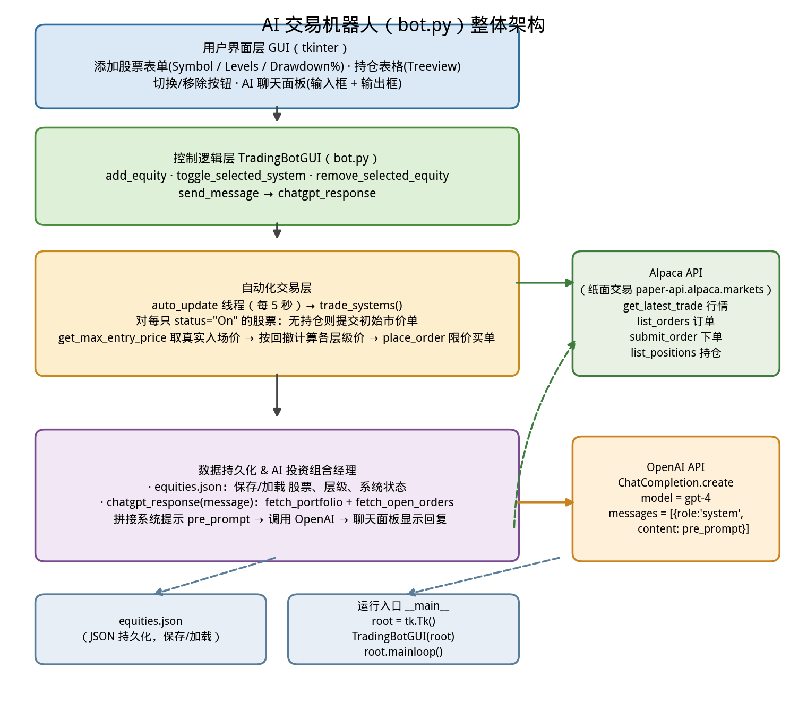

# How to Build an AI Trading Bot in Python

> 本教材基于 Roman Paolucci 的教学视频 [How to Build an AI Trading Bot in Python](https://www.youtube.com/watch?v=_87QHZXOOKA) 的内容整理而成。这是一期接近 1 小时时长的完整编程教程：用 Python + Alpaca 券商 API + OpenAI 大模型，从零构建一个能自动下单、又能用 AI 分析投资组合的**交易机器人（trading bot）**。视频配套的完整项目源码已发布在作者的 GitHub：[AI_Trading_Bot](https://github.com/romanmichaelpaolucci/AI_Trading_Bot)。

---

## 1. 概述

视频的核心思想非常简单直接：

> **用 Python 写一个桌面应用，把"下单交易"和"AI 分析持仓"两件事拼在一起，形成一个完整的 AI 交易机器人。**

罗马（Roman）在开头给出一份 5 步构建清单（见配套的 `checklist.ipynb`）：

```python
# 来源：checklist.ipynb（待办清单）
### How to Build an AI Trading Bot

#### TODO:

1.) Build a basic user interface (DONE)

2.) Establish connection to a Brokerage via API (Alpaca)

3.) Develop a strategy (Martingale/DCA)

4.) Integrate an LLM

5.) Deploy!
```

五个步骤分别是：

| 步骤 | 内容 | 用什么实现 |
|------|------|-----------|
| 1 | 构建基础用户界面（GUI） | Python 标准库 `tkinter` |
| 2 | 通过 API 连接券商（Brokerage） | **Alpaca** 模拟交易 API（paper trading） |
| 3 | 开发策略 | **马丁格尔-定投（Martingale DCA）**：价格每下跌一定百分比就加大仓位 |
| 4 | 集成大模型（LLM） | **OpenAI**（gpt-4），作为"AI 投资组合经理" |
| 5 | 部署运行 | 把整套系统跑起来，自动巡检、自动下单 |

几个关键设计选择：

- **AI 不参与信号分析**。作者明确说，LLM 在这里不做买卖信号，而是做**仓位管理（position management）**——你可以直接问它"我的风险敞口（risk exposure）怎么样"。
- **策略是马丁格尔-定投**：以初始入场价（entry price）为基准，价格每跌破一个回撤（drawdown）阈值，就在下一层补仓，越跌买得越多。
- **全程使用 Alpaca 模拟盘（paper trading）**，不花真钱也能完整测试。

> 一句话：**这份教材带你把一个"GUI + 券商 API + 大模型"的小系统从零写出来，而交易策略本身很简单，重点是工程整合。**

---

## 2. 整体架构

下面是本机器人（`bot.py`）的整体架构图，方便先建立全局印象：



整个系统可以拆成四层：

1. **用户界面层（GUI）**：tkinter 窗口，用于添加股票、看持仓表、开关系统、跟 AI 对话。
2. **控制逻辑层（TradingBotGUI 类）**：把 UI 事件翻译成具体动作（添加/切换/移除/发消息）。
3. **自动化交易层**：后台线程每隔 5 秒调用 `trade_systems()`，对每个"已开启"的系统自动下初始单与层级限价单。
4. **外部服务**：Alpaca（行情 + 订单 + 持仓）和 OpenAI（LLM 分析）；同时用 `equities.json` 做数据持久化。

视频中对应的三个代码文件：

| 文件 | 作用 |
|------|------|
| `bot.py` | 主程序，完整交易机器人（GUI + 交易循环 + AI 组件） |
| `alpaca.ipynb` | Alpaca API 入门笔记本，先在这里验证行情/订单接口 |
| `openai.ipynb` | OpenAI API 入门笔记本，先在这里验证 LLM 分析接口 |
| `checklist.ipynb` | 5 步构建清单 |
| `equities.json` | 运行时的数据持久化文件（保存股票、层级、状态） |

---

## 3. 环境与密钥配置

### 3.1 安装依赖

视频里反复提醒：遇到 `ModuleNotFoundError` 就说明包没装，用 `pip` 安装即可。

```bash
pip install alpaca-trade-api     # Alpaca 交易 API
pip install openai==0.28         # 注意：视频使用 0.28 版本（ChatCompletion 接口）
```

> 视频中作者在 openai 新版（v1+）上遇到了 "the api is removed in V1" 的报错，回退到 `openai==0.28` 才正常。**这说明集成老牌 API 时，版本兼容是个常见的坑。**

### 3.2 Alpaca：模拟盘（Paper Trading）

1. 前往 [app.alpaca.markets](https://app.alpaca.markets/account/login) 注册免费账户。
2. **务必在 Paper（模拟）账户下生成 API 密钥**——在真实账户下可能因资金不足而失败。
3. 拿到 `API Key` 和 `Secret Key`（Secret Key 只显示一次，务必保存好）。
4. 模拟盘的 Base URL 是：

```
https://paper-api.alpaca.markets/
```

### 3.3 OpenAI：获取 API Key

前往 [platform.openai.com/api-keys](https://platform.openai.com/api-keys) 生成密钥。作者提示可能需要付费账户才能调用，且**完全可以用其他任何 LLM 替代 ChatGPT**——代码里的思路是一样的。

> **安全提示**：API 密钥是"钥匙"，不要提交到公开仓库，不要发给别人。视频中的密钥只是演示占位。

---

## 4. Alpaca API 入门（alpaca.ipynb）

在把 API 集成进 bot 之前，先在 Jupyter notebook 里验证三个能力：**建立连接、查行情、找最大入场价**。

### 4.1 建立 REST 连接

```python
# 来源：alpaca.ipynb
import alpaca_trade_api as tradeapi

key = "KEY_ALPCA"
secret_key = "SECRET_KEY_ALPCA"
BASE_URL = "https://paper-api.alpaca.markets/"

api = tradeapi.REST(key, secret_key, BASE_URL, api_version="v2")
```

要点：

- 用 `tradeapi.REST` 创建 API 对象，传入密钥和 Base URL；
- `api_version="v2"` 指定版本；
- 视频里还修了一个小 bug：Base URL 结尾已经带 `/v2`，就不该再拼一次 `v2`，否则 URL 重复。

### 4.2 获取最新行情

```python
# 来源：alpaca.ipynb
def get_data(symbol):
    try:
        barset = api.get_latest_trade(symbol)
        return {"price":barset.price}
    except Exception as e:
        return {"price":-1}

get_data("AAPL")
```

- `api.get_latest_trade(symbol)` 返回最新成交（latest trade）；
- 用 try/except 兜底，失败时返回 `-1` 价格——这是视频里反复使用的防御式写法。

### 4.3 获取最大入场价（真实入场价）

```python
# 来源：alpaca.ipynb
def get_max_entry_price(symbol):
    try:
        orders = api.list_orders(status="filled", limit=50)
        prices = [float(order.filled_avg_price) for order in orders if order.filled_avg_price]
        return max(prices) if prices else -1
    except Exception as e:
        return 0
get_max_entry_price("AAPL")
```

逻辑：列出已成交订单，收集每笔的平均成交价（`filled_avg_price`），取其中最大值。**这个"最大成交价"被当作我们的初始入场价**——因为马丁格尔策略的入口是第一笔最高价买入。

> 小结：Alpaca 这边的能力就三件——查价格、列订单、取成交价。真正的下单（`submit_order`）放到主程序里讲。

---

## 5. OpenAI 集成（openai.ipynb）

OpenAI 这边的目标：**让大模型拿到你的实时投资组合和未成交订单，然后回答关于组合的任何问题**。这就是"AI 投资组合经理"。

### 5.1 组装提示词（pre-prompt）

```python
# 来源：openai.ipynb（analyze_message 函数节选）
def analyze_message(message):
    portfolio_data = fetch_portfolio()
    open_orders = fetch_open_orders()

    pre_prompt = f"""
    You are an AI Portfolio Manage responsible for analyzing my portfolio.
    Your tasks are the following:
    1.) Evaluate risk exposures of my current holdings
    2.) Analyze my open limit orders and their potential impact
    3.) provide insights into portfolio health, diversification, trade adj. etc.
    4.) Speculate on the market outlook based on current market conditions
    5.) Identify potential market risks and suggest risk management strategies

    Here is my portfolio: {portfolio_data}

    Here are my open orders {open_orders}

    Overall, answer the following question with priority having that background: {message}
    """
```

关键技巧：

- **预提示（pre-prompt / system prompt）**：先给 LLM 一个"角色设定 + 任务清单"（角色：AI 投资组合经理；任务：评估风险敞口、分析限价单影响、给出组合健康度/分散化/交易调整建议、推测市场前景、识别市场风险）。
- **把真实数据拼进提示词**：`{portfolio_data}`（持仓）和 `{open_orders}`（未成交订单）是实时拉取的，LLM 因此"知道"你当前的真实仓位。
- 用户的问题（`message`）作为最终要回答的问题追加在最后。

### 5.2 调用模型

```python
# 来源：openai.ipynb（analyze_message 函数节选）
    response = openai.ChatCompletion.create(
        model="gpt-4",
        messages=[{"role":"system", "content":pre_prompt}],
        api_key = "SECRET_KEY_OPENAI"
    )
    return response['choices'][0]['message']['content']

analysis = analyze_message("How is my portfolio doing?")
```

- 视频使用的是老接口 `openai.ChatCompletion.create`（对应 `openai==0.28`）；
- `messages=[{"role":"system","content":pre_prompt}]` 把系统提示传给模型；
- 返回值在 `response['choices'][0]['message']['content']`；
- 视频里踩了个小坑：**忘写 `return` 导致 analysis 一直为空**——调用外部 API 时，确认好函数确实把结果传回来。

### 5.3 实时数据：fetch_portfolio 与 fetch_open_orders

这两个函数从 Alpaca 拉取数据，供提示词使用（在 `bot.py` 中也有同样的实现）：

```python
# 来源：bot.py
def fetch_portfolio():
    positions = api.list_positions()
    portfolio = []
    for pos in positions:
        portfolio.append({
            'symbol':pos.symbol,
            'qty':pos.qty,
            'entry_price':pos.avg_entry_price,
            'current_price':pos.current_price,
            'unrealized_pl':pos.unrealized_pl,
            'side': 'buy'
        })
    return portfolio

def fetch_open_orders():
    orders = api.list_orders(status='open')
    open_orders = []
    for order in orders:
        open_orders.append({
            'symbol':order.symbol,
            'qty':order.qty,
            'limit_price':order.limit_price,
            'side': 'buy'
        })
```

> 原理：`api.list_positions()` 拿到所有持仓，`api.list_orders(status='open')` 拿到未成交订单，把它们整理成结构化列表，再塞进提示词。LLM 因此能针对**当下的真实持仓**给出分析，而不是空谈。

---

## 6. 主程序 bot.py：完整结构

### 6.1 导入与全局配置

```python
# 来源：bot.py
import tkinter as tk
from tkinter import ttk, messagebox
import json
import time
import threading
import random
import alpaca_trade_api as tradeapi
import openai

DATA_FILE = "equities.json"

key = "KEY_ALPACA"
secret_key = "SECRET_KEY_ALPCA"
BASE_URL = "https://paper-api.alpaca.markets/"
api = tradeapi.REST(key, secret_key, BASE_URL, api_version="v2")
```

导入的东西各司其职：

| 模块 | 用途 |
|------|------|
| `tkinter` / `ttk` | 构建 GUI（窗口、标签、输入框、按钮、表格） |
| `json` | `equities.json` 的保存与加载 |
| `time` | 每 5 秒一次的巡检间隔 |
| `threading` | 后台线程自动刷新，不阻塞 GUI |
| `random` | 演示用的模拟价格 |
| `alpaca_trade_api` | 券商 API（行情、订单、持仓） |
| `openai` | 大模型 API（组合分析） |

### 6.2 GUI 布局

构造函数 `TradingBotGUI.__init__` 组装了整张窗口，从上到下是：

1. **添加股票表单**：Symbol（股票代码）、Levels（层数）、Drawdown%（回撤），加一个 `Add Equity` 按钮；
2. **持仓表格**（`ttk.Treeview`）：列 = Symbol / Position / Entry Price / Levels / Status；
3. **控制按钮**：`Toggle Selected System`（开关系统）、`Remove Selected Equity`（移除股票）；
4. **AI 聊天面板**：一个输入框 `Entry` + `Send` 按钮 + 只读的文本输出框（`state=tk.DISABLED`，防止篡改 AI 回复）。

```python
# 来源：bot.py（GUI 布局核心）
# 表格：跟踪已交易的股票
self.tree = ttk.Treeview(root, columns=("Symbol", "Position", "Entry Price", "Levels", "Status"), show='headings')
for col in ["Symbol", "Position", "Entry Price", "Levels", "Status"]:
    self.tree.heading(col, text=col)
    self.tree.column(col, width=120)
self.tree.pack(pady=10)

# AI 聊天面板
self.chat_output = tk.Text(root, height=5, width=60, state=tk.DISABLED)
self.chat_output.pack()
```

### 6.3 核心交易循环：trade_systems + place_order

这是全系统最复杂的部分，职责是：**对每一个状态为 On 的股票，保证"初始市价单 + 各级限价单"都被正确挂出，并且不重复下单**。

```python
# 来源：bot.py（trade_systems 核心逻辑节选）
def trade_systems(self):
    for symbol, data in self.equities.items():
        if data['status'] == 'On':
            position_exists = False
            try:
                position = api.get_position(symbol)
                entry_price = self.get_max_entry_price(symbol)
                position_exists = True
            except Exception as e:
                # 还没有持仓 -> 下一个初始市价单
                api.submit_order(
                    symbol=symbol, qty=1, side="buy",
                    type="market", time_in_force="gtc"
                )
                messagebox.showinfo("Order Placed", f"Initial Order Placed for {symbol}")
                time.sleep(2)
                entry_price = self.get_max_entry_price(symbol)

            # 基于真实入场价 + 回撤，计算每一层的买入价
            level_prices = {i+1:round(entry_price*(1-data['drawdown']*(i+1)), 2)
                            for i in range(len(data['levels']))}
            existing_levels = self.equities.get(symbol, {}).get('levels', {})
            for level, price in level_prices.items():
                if level not in existing_levels and -level not in existing_levels:
                    existing_levels[level] = price

            self.equities[symbol]['entry_price'] = entry_price
            self.equities[symbol]['levels'] = existing_levels
            self.equities[symbol]['position'] = 1

            for level, price in level_prices.items():
                if level in self.equities[symbol]['levels']:
                    self.place_order(symbol, price, level)

        self.save_equities()
        self.refresh_table()
    else:
        return
```

```python
# 来源：bot.py（place_order：挂限价买单并标记层级）
def place_order(self, symbol, price, level):
    if -level in self.equities[symbol]['levels'] or '-1' in self.equities[symbol]['levels'].keys():
        return

    try:
        api.submit_order(
            symbol=symbol, qty=1, side='buy',
            type='limit', time_in_force='gtc',
            limit_price=price
        )
        self.equities[symbol]['levels'][-level] = price
        del self.equities[symbol]['levels'][level]
        print(f"Placed order for {symbol}@{price}")
    except Exception as e:
        messagebox.showerror("Order Error", f"Error placing order {e}")
```

关键设计：

- **用"负层级键"防重复下单**：下单成功后，把层级从正的 `level` 改成负的 `-level`。下一次巡检发现 `-level` 已存在就直接跳过，保证同一价位只挂一单。
- **`get_max_entry_price` 决定真实入场价**：以 Alpaca 里已成交订单的最大成交价作为入口价，而不是用模拟的 100。
- **"先初始单，再逐层单"**：没持仓 → 下一个市价单（qty=1）→ 等 2 秒成交 → 拿到真实入场价 → 按回撤生成各层限价单。
- 配套的 `check_existing_orders(symbol, price)` 会在下单前检查该价位是否已有活跃订单：

```python
# 来源：bot.py
def check_existing_orders(self, symbol, price):
    try:
        orders = api.list_orders(status='open', symbols=symbol)
        for order in orders:
            if float(order.limit_price) == price:
                return True
    except Exception as e:
        messagebox.showerror("API Error", f"Error Checking Orders {e}")
    return False
```

### 6.4 后台自动巡检线程

```python
# 来源：bot.py
# 构造时启动后台线程
self.running = True
self.auto_update_thread = threading.Thread(target=self.auto_update, daemon=True)
self.auto_update_thread.start()

# 线程主体：每 5 秒跑一次交易逻辑
def auto_update(self):
    while self.running:
        time.sleep(5)
        self.trade_systems()
```

- 用 `daemon=True` 守护线程，不阻塞程序退出；
- `running` 标志由 `on_close()` 置为 False，实现优雅关闭。

### 6.5 数据持久化与生命周期

```python
# 来源：bot.py
DATA_FILE = "equities.json"

def save_equities(self):
    with open(DATA_FILE, 'w') as f:
        json.dump(self.equities, f)

def load_equities(self):
    try:
        with open(DATA_FILE, 'r') as f:
            return json.load(f)
    except (FileNotFoundError, json.JSONDecodeError):
        return {}

def on_close(self):
    self.running = False
    self.save_equities()
    self.root.destroy()

if __name__ == '__main__':
    root = tk.Tk()
    app = TradingBotGUI(root)
    root.protocol("WM_DELETE_WINDOW", app.on_close)
    root.mainloop()
```

- 关窗口时把整个 `self.equities`（股票、层级、状态）存进 `equities.json`；
- 下次启动 `load_equities()` 读回来，重新填充界面——"关掉再打开，系统还记得你在交易什么"；
- `json.JSONDecodeError` 兜底，文件坏了就返回空字典。

### 6.6 命令与功能一览

| 界面元素 / 函数 | 功能 |
|------|------|
| **Add Equity** | 把 Symbol + Levels + Drawdown 加入系统；用模拟价 100 生成初始层级价 |
| **Toggle Selected System** | 切换选中股票的系统状态（On/Off）——On 才会被自动交易 |
| **Remove Selected Equity** | 从系统移除选中股票，保存并刷新表格 |
| **Send（聊天）** | 把消息交给 `chatgpt_response`，将 AI 分析显示在聊天输出框 |
| **auto_update（线程）** | 每 5 秒调用 `trade_systems` 自动巡检 |
| **trade_systems** | 对每只 On 的股票：初始市价单 → 真实入场价 → 生成层级 → 逐层下单 |
| **place_order** | 挂限价买单，并把层级标记为负（防重复） |
| **check_existing_orders** | 检查某价位是否已有活跃订单 |
| **get_max_entry_price** | 从已成交订单中取最大成交价 = 真实入场价 |
| **fetch_alpaca_data / get_data** | 获取股票最新行情 |
| **save_equities / load_equities** | 保存/加载 `equities.json` |
| **on_close** | 关闭时保存数据并销毁窗口 |

---

## 7. 运行与测试（模拟盘）

### 7.1 完整运行流程

1. 运行 `python bot.py`，弹出 GUI；
2. 输入 `Symbol=AAPL`、`Levels=5`、`Drawdown=5`，点 **Add Equity**——生成 5 个层级；
3. 在表格选中 Apple，点 **Toggle Selected System** 打开系统；
4. 系统随即提交**初始市价单**，弹窗提示 "Initial Order Placed for AAPL"；
5. 到 Alpaca 模拟盘查看：初始订单已成交，后续 5 个层级出现**限价买单**，价格按 `入场价 × (1 − 5% × 层级)` 逐级下移；
6. 因为层级键被标记为负，下一轮巡检**不会重复下单**；关掉再打开系统，也会正确重读层级信息。

### 7.2 多股票支持

同一套逻辑对多只股票生效：视频里先建了 Apple，又建了 J&J（强生），两套系统各自独立地完成"初始单 + 层级单"。

### 7.3 模拟盘（paper trading）的价值

- 不需要真金白银，就能验证：下单是否真的挂上、价格是否算对、会不会重复下单；
- 即便"盲目跟着教程跑"，由于 API 不会允许你上巨额杠杆，马丁格尔策略也不容易直接爆仓；
- **上线真实账户前，务必先在模拟盘跑通、充分回测。**

---

## 8. 局限性与安全提示

| 风险/局限 | 说明 |
|-----------|------|
| **密钥泄露** | API Key/Secret Key 是资金账户的"钥匙"，绝不能写进公开仓库或发给他人 |
| **马丁格尔策略风险** | 越跌买得越多、仓位呈递增，虽然杠杆受限，但如果行情单边下跌，累积亏损仍然可能很大；本系统没有退出（exit）条件 |
| **LLM 幻觉** | AI 组合经理只是"读你的数据 + 给建议"，**不构成投资建议**，也可能一本正经地胡说 |
| **版本兼容** | `openai` 新老接口差异巨大（视频被迫用 `==0.28`）；升级依赖前先跑一遍测试 |
| **真实资金** | 教程只演示模拟盘；真实交易前必须自行评估风险、做足回测与风控 |
| **异常兜底很浅** | 代码用 `try/except` 兜底但没有日志与告警，生产环境需要更强的健壮性 |

> 视频作者的态度很明确：这是一个**教学/工作坊项目**，但它是很好的起点——你可以在此基础上加退出条件、加基于 LLM 的事件触发交易、接实时新闻与宏观因子等。

---

## 9. 关键要点总结

| 主题 | 要点 |
|------|------|
| **5 步构建清单** | GUI → 券商 API → 策略 → LLM → 部署 |
| **策略** | 马丁格尔-定投（Martingale DCA）：每跌一个 drawdown 阈值补一层 |
| **券商接入** | Alpaca 模拟盘，`tradeapi.REST(key, secret, BASE_URL, api_version="v2")` |
| **AI 的角色** | 不做信号，做**仓位管理 / 组合分析**（pre-prompt + 实时持仓 + 未成交订单） |
| **防重复下单** | 用负层级键 `-level` 标记已挂单 |
| **真实入场价** | 用 `get_max_entry_price`（已成交订单最大成交价） |
| **持久化** | `equities.json` 保存股票、层级、系统状态，重启后自动恢复 |
| **后台巡检** | `threading` 线程每 5 秒调 `trade_systems` |
| **AI 提示词** | system prompt 给出角色 + 5 项任务 + 实时组合数据 |

### 一句话总结

> 用一个 tkinter GUI 管理"交易哪只股票、分几层、跌多少补仓"，后台线程通过 Alpaca 自动挂出初始市价单和逐层限价单，再用 OpenAI 大模型把实时持仓与未成交订单喂给提示词、随时回答你"我的组合怎么样"——这就是一个麻雀虽小、五脏俱全的 **AI 交易机器人**。

---

## 10. 延伸阅读

- 项目源码：[AI_Trading_Bot（GitHub）](https://github.com/romanmichaelpaolucci/AI_Trading_Bot)
- Alpaca 登录与密钥：[app.alpaca.markets](https://app.alpaca.markets/account/login)
- OpenAI API Keys：[platform.openai.com/api-keys](https://platform.openai.com/api-keys)
- [Quant Guild 官网](https://quantguild.com)
- [Quant Guild 博客（Medium）](https://medium.com/quant-guild)
- [Roman Paolucci 博客（Medium）](https://romanmichaelpaolucci.medium.com/)
- [Quant Guild GitHub](https://github.com/Quant-Guild)
- [Quant Guild Discord](https://discord.com/invite/MJ4FU2c6c3)

---

*本教材由 Roman Paolucci 的教学视频 [How to Build an AI Trading Bot in Python](https://www.youtube.com/watch?v=_87QHZXOOKA) 整理而成。*
