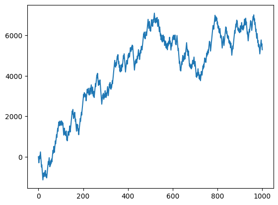
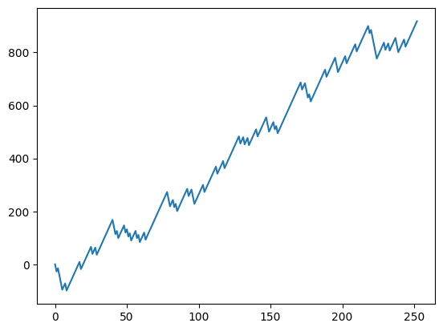

# How to Make & Lose Money Trading — Problems with Statistics in Trading

> **基于 Quant Guild 视频讲座的课程教材**
>
> 视频原址: https://www.youtube.com/watch?v=WP9fb7AMFsI
> 讲师: Roman Paolucci

---

## 概述

本课程教材源于 Quant Guild 的视频讲座 *How to Make & Lose Money Trading*，结合了 Jupyter Notebook 中的代码示例与讲座中的理论讲解。

交易的核心是**统计推断**。我们无法知道市场未来的确切走势，只能通过历史数据来估计策略的参数、评估策略的期望收益。但统计工具在金融市场中的应用充满了陷阱——参数估计的误差、非平稳性的影响、以及"优势"(Edge)的真正含义。本教材将逐一探讨这些问题。

---

## 目录

1. [问题一：参数估计 (Parameter Estimation)](#问题一参数估计-parameter-estimation)
2. [问题二：平稳性 (Stationarity)](#问题二平稳性-stationarity)
3. [问题三：交易中的"优势" (Edge)](#问题三交易中的优势-edge)
4. [期望收益的分解](#期望收益的分解)
5. [权益曲线与长期表现](#权益曲线与长期表现)
6. [交互探索：调整参数观察 Edge](#交互探索调整参数观察-edge)
7. [结论与实践建议](#结论与实践建议)

---

## 问题一：参数估计 (Parameter Estimation)

### 核心问题

在交易中，我们永远无法知道某个过程的"真实参数"。如果知道，就没有建模的必要了。在金融市场中，无论是股票价格路径、衍生品定价还是交易策略，我们面对的都是未知的底层分布。

类比抛硬币：如果知道每次抛硬币正面朝上的概率是 0.5，我们不需要去估计它。但在交易中，我们不知道"赢的概率"是多少，只能通过有限的数据去估计。

### 抛硬币实验

假设我们抛一枚公平硬币 10 次，每次正面记作 1，反面记作 0：

```python
import numpy as np
import pandas as pd

heads = []

flips = np.random.binomial(10, .5)
for h in range(0, flips):
    heads.append(1)

heads = heads + [0]*(10 - flips)

print(heads)
```

输出的随机结果可能是：

```
[1, 1, 0, 0, 0, 0, 0, 0, 0, 0]
```

在这个样本中，我们只观察到 2 次正面（20%），而真实的参数是 50%。

> **💡 交易启示**：如果这 10 次抛掷是你能观察到的唯一数据——就像**过去 10 个交易日只有一次发生**一样——你无法重来。你会用这 10 个数据点来估计策略的胜率。但如果真实的胜率是 50%，而你的估计是 20%，你的决策就会产生严重偏差。

### 关键点

- 我们有置信区间、模拟、方差缩减等工具来改进参数估计
- 但**样本量有限**是不可改变的事实
- 在交易中，100 次交易是否足够估计胜率？1000 次呢？
- 你只有有限的资金来回测和实盘

---

## 问题二：平稳性 (Stationarity)

### 核心问题

参数估计有一个关键假设：**参数不随时间变化**。在抛硬币的例子里，这意味着每次抛掷的正反面概率都是 0.5。

但在金融市场中，这个假设几乎总是**不成立**。策略的胜率、盈亏比都会随时间变化——这就是**非平稳性 (Non-Stationarity)**。

### 模拟非平稳参数

下面的代码让 `p`（正面概率）随时间随机变化：

```python
heads = []

p = .5 + np.random.normal(0, .1)
flips = np.random.binomial(10, p)
for h in range(0, flips):
    heads.append(1)

heads = heads + [0]*(10 - flips)

print(heads)
print('Estimated Parameter:', np.mean(heads))
print('Parameter:', p)
```

输出示例：

```
[1, 1, 0, 0, 0, 0, 0, 0, 0, 0]
Estimated Parameter: 0.2
Parameter: 0.3951790387226596
```

这个例子中，真实参数 `p` 本身是随机的（均值为 0.5，但每次实验都变化），但我们依然用样本均值去估计它，结果可能显著偏离。

### 多次实验的对比

如果反复进行这个实验：

| 实验 | 真实参数 p | 估计值 |
|------|-----------|--------|
| 1    | 0.46      | 0.7    |
| 2    | 0.51      | 0.5    |
| 3    | 0.40      | 0.2    |

我们有时高估、有时低估，而且**不知道**参数何时会变化——每隔 30 分钟？1 小时？10 天？无人知晓。

### 回测的局限性

> **历史表现不代表未来收益** (Past performance is not indicative of future results)

这句话的根本原因就是**非平稳性**。你可以在回测中表现出色，但一旦参数发生变化，策略可能立刻失效。

### 更多统计问题

参数估计和平稳性只是冰山一角。其他的常见问题包括：

- **独立性假设的违反**：交易收益往往不是独立的（如波动率聚集效应）
- **分布假设错误**：假设收益服从正态/对数正态分布，但实际具有**尖峰厚尾 (Leptokurtosis)** 特征
- **波动率聚集 (Volatility Clustering)**：大波动后通常跟着大波动
- **杠杆效应 (Leverage Effect)**：价格下跌时波动率上升
    > 假设一家公司总资产价值为 $V$，债务为 $D$，股本为 $E$，那么 $V = D + E$。    
    > 1. 股价下跌 → 公司市值 $E$ 缩水
    > 2. 债务 $D$ 不变（短期不变）
    > 3. 杠杆率 $D/E$ 上升
    > 4. 公司财务风险增大
    > 5. 股票的风险溢价提高
    > 6. 股价波动率上升
    >
    > 延伸：杠杆效应是很多波动率模型的基础设计 → EGARCH (Exponential GARCH) 直接对正负收益给予不对称权重 和 GJR-GARCH 用哑变量标记负收益
---

## 问题三：交易中的"优势" (Edge)

### 什么是 Edge

简单来说，**Edge** 是指：如果你能无数次重复某个交易策略，长期来看你会赚钱。用数学语言说，就是策略的期望收益严格为正，且在一段时间内保持为正。

更正式地，一个交易策略 $S$ 的期望 P/L 可以写成：

$$\mathbb{E}[S] = \mathbb{E}[S | W = 1]P(W = 1) + \mathbb{E}[S | W = 0]P(W = 0)$$

其中：
- $W = 1$ 表示盈利交易 (Win)
- $W = 0$ 表示亏损交易 (Loss)

这被称为**全期望公式 (Law of Total Expectation)**。

> **📐 推导**：全期望公式告诉我们，无条件期望 = 条件期望的加权平均。在这里，它将策略的整体期望分解为"盈利时的平均收益 × 盈利概率"加上"亏损时的平均损失 × 亏损概率"。

### 分解 Edge 的价值

这个分解比直接看总的平均 P/L 更有信息量，因为它揭示了：

1. **你的胜率有多高**
2. **你赢的时候赚多少，输的时候亏多少**
3. **两者如何共同决定你的整体 Edge**

### 示例数据

假设我们有 7 笔交易的数据：

```python
trading_results = pd.DataFrame(columns=['P/L', 'Win', 'Loss'])
pl = [150, 120, 90, 100, -300, -100, -50]
wins = [1, 1, 1, 1, 0, 0, 0]
losses = [0, 0, 0, 0, 1, 1, 1]

trading_results['P/L'] = pl
trading_results['Win'] = wins
trading_results['Loss'] = losses

trading_results
```

|   | P/L  | Win | Loss |
|---|------|-----|------|
| 0 | 150  | 1   | 0    |
| 1 | 120  | 1   | 0    |
| 2 | 90   | 1   | 0    |
| 3 | 100  | 1   | 0    |
| 4 | -300 | 0   | 1    |
| 5 | -100 | 0   | 1    |
| 6 | -50  | 0   | 1    |

### 计算各个分量

```python
print("Expected P/L:", float(np.mean(trading_results['P/L'])))
print("Expected Win P/L:", float(np.mean(trading_results[trading_results['Win'] > 0]['P/L'])))
print("Expected Loss P/L:", float(np.mean(trading_results[trading_results['Loss'] > 0]['P/L'])))
print("Probability of Win: ", float(np.mean(trading_results['Win'])))
print("Probability of Loss: ", float(np.mean(trading_results['Loss'])))
```

输出：

```
Expected P/L: 1.4285714285714286
Expected Win P/L: 115.0
Expected Loss P/L: -150.0
Probability of Win:  0.5714285714285714
Probability of Loss:  0.42857142857142855
```

### 验证全期望公式

$$\mathbb{E}[S] = 0.5714 \times 115 + 0.4286 \times (-150) = 65.71 - 64.29 \approx 1.43$$

结果与直接计算的平均 P/L 一致。

> **💡 交易启示**：这 7 笔交易的 Edge 非常微弱（约 $1.43/笔）。这意味着它很容易被随机性淹没——你可能连续亏损很多笔，然后怀疑策略是否真的有效。

---

## 权益曲线与长期表现

### 模拟一年交易

有了 estimated 参数，我们可以模拟策略随时间演进。以下模拟 252 个交易日（大约一年），每天根据胜率和盈亏比随机产生一笔交易：

```python
import matplotlib.pyplot as plt

pl = [0]
for i in range(252):
    pl.append(115 if np.random.binomial(1, 0.6) > 0 else -150)

plt.plot(np.cumsum(pl))
```


运行多次会产生完全不同的权益曲线。由于 Edge 很小（约 $1.43），一年后的结果可能是亏损 $3000，也可能是盈利 $750。

### 长期表现：Edge 需要时间来显现

随着时间跨度增加，Edge 会越来越明显：

| 交易天数 | 权益曲线特征 |
|---------|------------|
| 252 天 (1年) | 高度随机，可能亏损也可能盈利 |
| 2,000 天 | 开始出现上升趋势 |
| 100,000 天 | 稳定的正斜率 |
| 1,000,000 天 | Edge 清晰可见 |

这就是"**长期来看你会赚钱，前提是你得先活过短期**"。

> **⚠️ Gambler's Fallacy 视角**：即使策略有正的期望值，如果资金管理不当或波动过大，你仍然可能在 Edge 显现之前**破产**。这是随机过程中的"吸收态"问题——一旦破产，游戏就结束了。

### 参数错误的风险

如果参数估计有误会怎样？比如真实胜率只有 40% 而不是 57%：

- 权益曲线会持续向下
- 策略可能实际上是一个**负 Edge** 策略
- 交易成本（佣金、滑点）可以让一个微弱的正 Edge 变成负 Edge

---

## 交互探索：调整参数观察 Edge

下面的交互式工具可以调整三个关键参数，实时观察 Edge 的变化：

| 参数 | 说明 | 范围 |
|-----|------|------|
| Win Probability | 盈利交易的概率 | 0 ~ 1 |
| Win Expectation | 盈利交易的平均盈利 ($) | -200 ~ 200 |
| Loss Expectation | 亏损交易的平均亏损 ($) | -200 ~ 200 |

### Edge 的计算公式

$$\text{Edge} = P(\text{Win}) \times \mathbb{E}[S|\text{Win}] + P(\text{Loss}) \times \mathbb{E}[S|\text{Loss}]$$

其中 $P(\text{Loss}) = 1 - P(\text{Win})$。

### 场景分析

| 场景 | 胜率 | 平均盈利 | 平均亏损 | Edge | 评价 |
|------|------|---------|---------|------|------|
| 基准 | 57% | \$115 | -\$150 | \$1.43 | 微弱正 Edge |
| 高胜率 | 80% | \$115 | -\$150 | \$62.00 | 强大的 Edge |
| 高胜率低盈亏 | 80% | \$10 | -\$150 | -\$22.00 | **正胜率，负 Edge！** |
| 低胜率 | 20% | \$115 | -\$150 | -\$97.00 | 负 Edge |

> **🔑 关键洞察**：**高胜率 ≠ 正 Edge**！如果胜率 80% 但每次盈利只有 \$10，亏损却高达 \$150，这仍然是一个负 Edge 的策略。
>
> 同样，**低胜率也不意味着没有 Edge**——很多成功的趋势跟踪策略胜率不到 40%，但盈亏比极高。

### 不同参数下的权益曲线对比

```python
import matplotlib.pyplot as plt

pl = [0]
for i in range(252):
    pl.append(win_exp_slider.value if np.random.binomial(1, win_prob_slider.value) > 0 else loss_exp_slider.value)

plt.plot(np.cumsum(pl))
```


尝试不同的参数组合：
- **正 Edge 且高胜率** → 权益曲线稳定向上
- **正 Edge 但低胜率** → 曲线波动较大，但长期向上
- **负 Edge** → 无论胜率高低，曲线最终向下

---

## 结论与实践建议

### 三个核心问题回顾

| 问题 | 描述 | 应对方法 |
|-----|------|---------|
| **参数估计** | 永远无法知道真实参数 | 使用多种估计方法，构建置信区间，理解不确定性 |
| **非平稳性** | 参数随时间变化 | 滚动窗口估计，关注 regime change，不要过度依赖历史数据 |
| **Edge 评估** | 期望值 = 胜率 × 平均盈利 + 亏损率 × 平均亏损 | 定期重新评估每个分量，建立稳健的风险管理 |

### 实践建议

1. **定期重新评估你的 Edge**：每周或每月重新计算你的胜率、平均盈利和平均亏损。使用滚动窗口而非全部历史数据。

2. **关注 Edge 的变化趋势**：不仅看当前的 Edge 数值，还要看它随时间的变化——Edge 在缩小吗？有没有 Regime Change 的信号？

3. **不要只关注胜率**：一个 40% 胜率的策略可能比 80% 胜率的策略更赚钱。关键指标是期望值。

4. **活下来是第一要务**：即使有正 Edge，也要管理好仓位和风险，确保不会在 Edge 显现之前破产。

5. **理解统计假设的局限性**：独立性、平稳性、分布假设——每一项在金融市场中都未必成立。

### 延伸阅读

- Gambler's Ruin 问题与资金管理
- 随机波动率模型 (Stochastic Volatility)
- 回测中的常见偏差（Look-ahead Bias, Overfitting 等）
- 夏普比率与其它风险调整收益指标

---

## 练习

1. **修改参数估计代码**：将抛硬币次数从 10 次改为 100 次、1000 次，观察估计值与真实值之间的差距如何变化。

2. **比较平稳 vs 非平稳**：运行 Problem 1 和 Problem 2 的代码各 100 次，分别记录估计误差的分布，观察两者的区别。

3. **盈亏比分析**：给定如下两组参数，分别计算 Edge 并模拟 252 天的权益曲线：
   - 胜率 35%，平均盈利 \$200，平均亏损 -\$80
   - 胜率 65%，平均盈利 \$50，平均亏损 -\$100

4. **交易日记分析**：回顾你最近的 20-30 笔交易（或模拟交易），计算你的实际胜率、平均盈利/亏损和 Edge。

---

> *"Trading strategies don't always work. Sometimes they work for a couple years, then they stop working. You've just got to survive a bonus cycle or two, and you'll get rich — and then you'll get fired, or the firm will go bankrupt."*
> — Roman Paolucci
