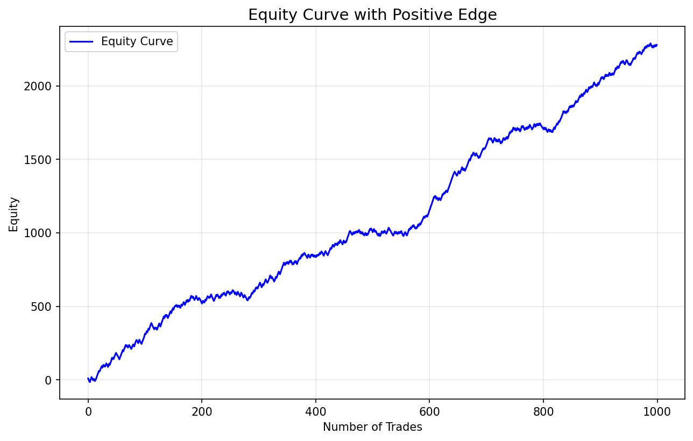
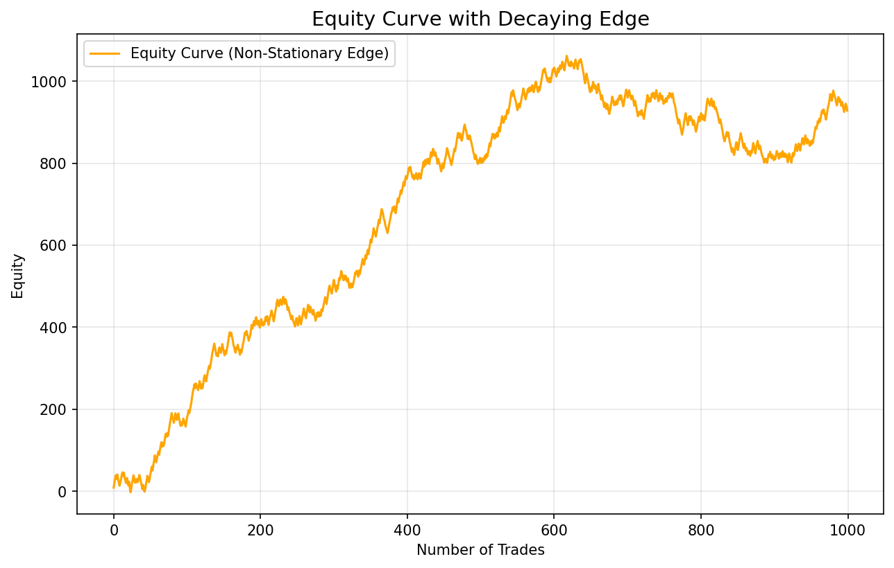
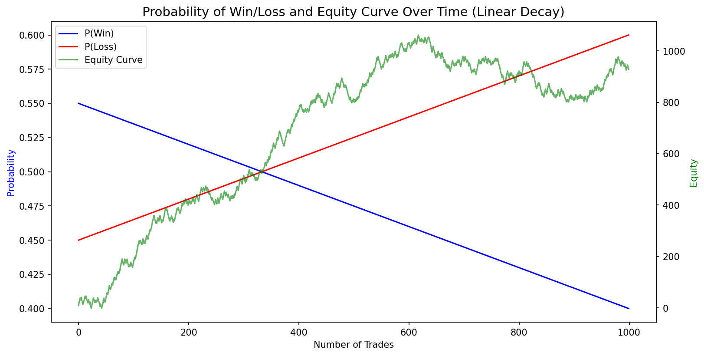
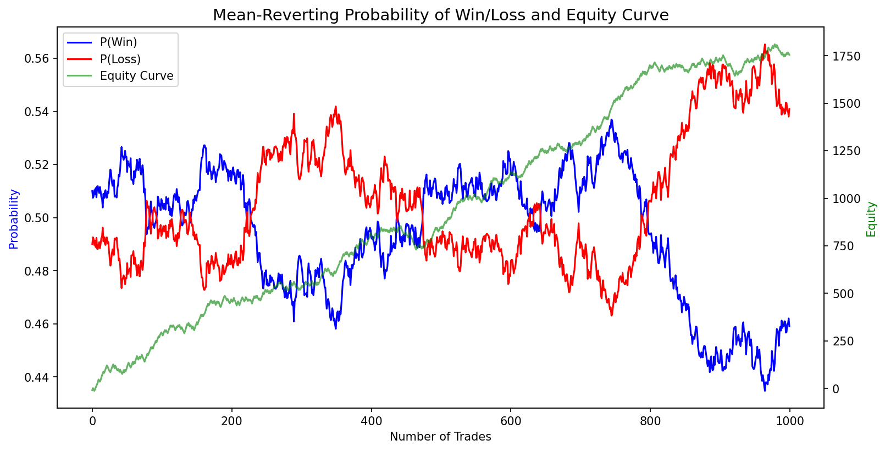
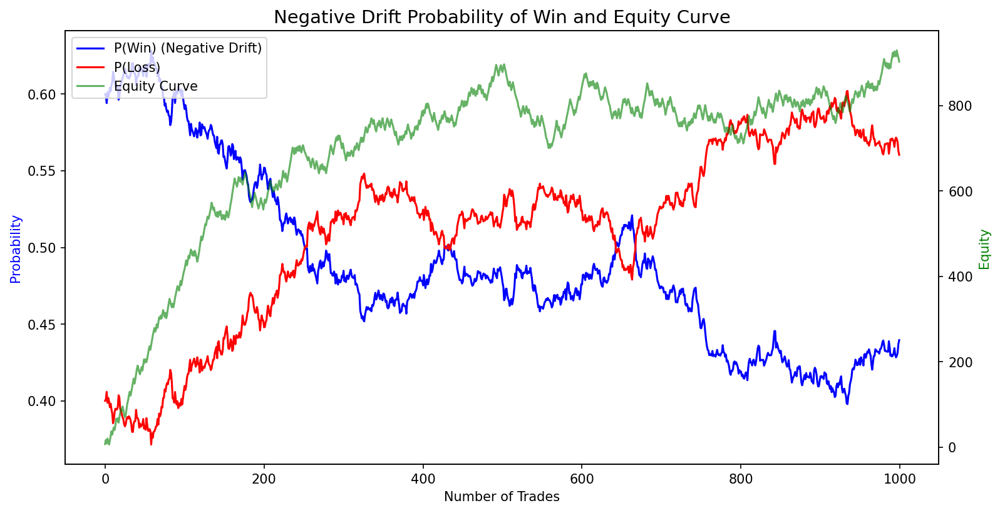

# Analyzing Trading Strategy Performance Over Time — 何时停止交易一个盈利的策略

> **基于 Quant Guild 视频讲座的课程教材**
>
> 视频原址: https://www.youtube.com/watch?v=boh9JkGPG9U
> 讲师: Roman Paolucci
> Jupyter Notebook: [When to Stop Trading a Profitable Strategy.ipynb](When%20to%20Stop%20Trading%20a%20Profitable%20Strategy.ipynb)

---

## 概述

上一节课我们探讨了如何用全期望公式 (Law of Total Expectation) 来量化交易策略的 **Edge**（优势）。本节课在此基础上继续深入：**Edge 不是静态的**——策略的胜率、盈亏比等参数会随时间变化。那么，什么时候应该停止交易一个曾经盈利的策略？

关键洞察：我们估计的策略参数本身服从某种 **未知的分布**，而这个分布具有 **非平稳性 (Non-Stationarity)** 的倾向。这意味着我们无法持续获得好的参数估计——当胜率开始下降时，我们可能再也看不到该系统成功的条件。

本教材将：
1. 回顾 Edge 的定义与分解
2. 模拟一个正 Edge 策略的权益曲线
3. 引入非平稳性，观察 Edge 衰减对权益曲线的影响
4. 探讨 Edge 参数的底层动态：线性衰减、均值回复、负漂移
5. 讨论如何通过监控 Edge 变化来做出交易决策

---

## 目录

1. [回顾：什么是 Edge](#回顾什么是-edge)
2. [模拟正 Edge 策略](#模拟正-edge-策略)
3. [引入非平稳性：Edge 的衰减](#引入非平稳性edge-的衰减)
4. [Edge 参数的底层动态](#edge-参数的底层动态)
   - [场景一：线性衰减 (Linear Decay)](#场景一线性衰减-linear-decay)
   - [场景二：均值回复过程 (Mean-Reverting Process)](#场景二均值回复过程-mean-reverting-process)
   - [场景三：负漂移过程 (Negative Drift Process)](#场景三负漂移过程-negative-drift-process)
5. [如何应对 Edge 的变化](#如何应对-edge-的变化)
6. [结论与实践建议](#结论与实践建议)
7. [练习](#练习)

---

## 回顾：什么是 Edge

在上一节课中，我们将一个交易策略的期望收益分解为：

$$
\text{Edge} = P(\text{Win}) \times \mathbb{E}[S|\text{Win}] - P(\text{Loss}) \times \mathbb{E}[S|\text{Loss}]
$$

其中：
- $P(\text{Win})$ = 盈利交易的概率（胜率）
- $P(\text{Loss}) = 1 - P(\text{Win})$ = 亏损交易的概率
- $\mathbb{E}[S|\text{Win}]$ = 平均每笔盈利交易的收益
- $\mathbb{E}[S|\text{Loss}]$ = 平均每笔亏损交易的损失

如果 $\text{Edge} > 0$，长期来看你会赚钱；如果 $\text{Edge} < 0$，长期来看你会亏钱。

### 参数的简化

如果你的策略使用固定的止盈止损（take-profit 和 stop-loss），那么 $\mathbb{E}[S|\text{Win}]$ 和 $\mathbb{E}[S|\text{Loss}]$ 可能是固定值。此时 Edge 的变化完全由胜率 $P(\text{Win})$ 驱动。即使在这种简化情况下，我们仍然面临非平稳性的问题。

---

## 模拟正 Edge 策略

首先，让我们模拟一个具有正 Edge 的策略。参数设置如下：

| 参数 | 值 |
|------|-----|
| 胜率 $P(\text{Win})$ | 0.55 (55%) |
| 平均盈利 $\mathbb{E}[S\|\text{Win}]$ | $10 |
| 平均亏损 $\mathbb{E}[S\|\text{Loss}]$ | $-8 |

计算 Edge：

$$
\text{Edge} = 0.55 \times 10 - 0.45 \times 8 = 5.5 - 3.6 = 1.9
$$

每笔交易的期望收益为 \$1.9。

### 代码实现

```python
import numpy as np
import matplotlib.pyplot as plt

n_trades = 1000
p_win = 0.55
avg_win = 10
avg_loss = -8

# 生成交易结果
win_lose = np.random.choice([1, -1], size=n_trades, p=[p_win, 1 - p_win])
trade_pnl = np.where(win_lose == 1, np.random.normal(avg_win, 2, n_trades),
                     np.random.normal(avg_loss, 2, n_trades))
equity_curve = np.cumsum(trade_pnl)

# 绘制权益曲线
plt.figure(figsize=(10, 6))
plt.plot(equity_curve, label="Equity Curve")
plt.title("Equity Curve with Positive Edge")
plt.xlabel("Number of Trades")
plt.ylabel("Equity")
plt.legend()
plt.grid(alpha=0.3)
plt.show()
```

### 结果



**观察要点**：

- 权益曲线呈现出"向右上角延伸"的特征——这正是正 Edge 的典型表现
- 但由于每笔交易都有随机性，即使运行同样的参数，每次得到的权益曲线都不完全相同
- 权益曲线越平滑，策略的风险越低
- 注意：实际盈亏数值是任意的——你可以通过加杠杆将整个曲线乘以 4 来放大利润

---

## 引入非平稳性：Edge 的衰减

现实世界中，策略的参数不是一成不变的。市场环境、监管政策、宏观经济条件等因素的变化都会影响策略的表现。

**核心问题**：我们估计的策略参数（胜率、盈亏比）本身服从某种未知的分布，而这个分布具有非平稳性。当我们开始亏损多于盈利时，可能再也看不到该策略成功的条件。

### 模拟胜率衰减

假设胜率从 0.55 线性衰减到 0.40，覆盖 1000 笔交易：

```python
n_trades = 1000
p_win_decay = np.linspace(0.55, 0.4, n_trades)  # 线性衰减

trade_pnl_decay = []
for i in range(n_trades):
    if np.random.rand() < p_win_decay[i]:
        trade_pnl_decay.append(np.random.normal(avg_win, 2))
    else:
        trade_pnl_decay.append(np.random.normal(avg_loss, 2))

trade_pnl_decay = np.array(trade_pnl_decay)
equity_curve_decay = np.cumsum(trade_pnl_decay)

plt.figure(figsize=(10, 6))
plt.plot(equity_curve_decay, label="Equity Curve (Non-Stationary Edge)")
plt.title("Equity Curve with Decaying Edge")
plt.xlabel("Number of Trades")
plt.ylabel("Equity")
plt.legend()
plt.grid(alpha=0.3)
plt.show()
```

### 结果



**对比分析**：

| 特征 | 正 Edge（固定参数） | 衰减 Edge |
|------|-------------------|----------|
| 权益曲线形态 | 持续向上 | 先升后平 |
| 1000 笔后结果 | 持续增长 | 明显 plateau（平台期） |
| 风险特征 | 稳定 | 逐渐恶化 |

这就是许多量化策略的真实写照——**策略曾经有效，但后来失效了**。比如一些基于市场情绪的策略在 2021-2022 年前表现很好，但之后开始 plateau。

---

## Edge 参数的底层动态

胜率 $P(\text{Win})$ 的动态变化可以有多种形式，而**我们不知道**它究竟服从哪种过程。如果我们知道，就不需要建模了。

以下是三种可能的动态类型：

### 场景一：线性衰减 (Linear Decay)

这是最直观的示例——胜率随时间线性下降。



图中蓝色线为胜率 $P(\text{Win})$，红色线为败率 $P(\text{Loss})$（两者互补），绿色线为权益曲线。

**观察**：
- 胜率从 0.55 线性下降到 0.40
- 当胜率下降时，权益曲线开始 plateau
- 虽然平均盈利 (10) 仍大于平均亏损 (8)，但胜率的下降使得整体 Edge 消失

**现实性评估**：实际市场中，胜率几乎不可能呈完美的线性衰减，但这种简化有助于理解核心概念。

---

### 场景二：均值回复过程 (Mean-Reverting Process)

均值回复过程（Ornstein-Uhlenbeck 过程）是指参数围绕某个长期均值波动的过程：

$$
dX_t = \theta(\mu - X_t)dt + \sigma dW_t
$$

其中：
- $\theta$ = 均值回复速度
- $\mu$ = 长期均值
- $\sigma$ = 波动率
- $dW_t$ = 标准布朗运动增量

```python
theta = 0.1   # 均值回复速度
mu = 0.51     # 长期均值
sigma = 0.09  # 波动率
dt = 1 / n_trades

# 生成均值回复的胜率序列
p_win_mean_reverting = [mu]
for _ in range(n_trades - 1):
    prev = p_win_mean_reverting[-1]
    dw = np.random.normal(0, np.sqrt(dt))
    next_val = prev + theta * (mu - prev) * dt + sigma * dw
    p_win_mean_reverting.append(min(max(next_val, 0), 1))
```



**观察**：
- 胜率围绕 0.51 的均值上下波动（存在正 Edge）
- 权益曲线虽然总体向上，但**远不如固定参数时平滑**
- 当胜率下跌到低点时，权益曲线会出现明显的平台期甚至回撤
- 如果加上交易成本（佣金、滑点），在胜率低谷期可能实际上亏损

**对比**：

| 场景 | 固定参数 | 均值回复 |
|------|---------|---------|
| 最终权益 | ~1750 | ~800 |
| 夏普比率 | 更高 | 更低 |
| 可预测性 | 完全已知 | 统计意义上的回归 |

---

### 场景三：负漂移过程 (Negative Drift Process)

胜率可能具有**趋势性**——一旦开始下降，就会持续下降（至少在一段时间内）：

```python
mu_drift = -0.4    # 负漂移
sigma_drift = 0.2  # 波动率

# 使用几何布朗运动生成负漂移的胜率
p_win_drift_stochastic = [0.6]
for _ in range(n_trades - 1):
    dw = np.random.normal(0, np.sqrt(dt))
    next_val = p_win_drift_stochastic[-1] * np.exp((mu_drift - 0.5 * sigma_drift**2) * dt + sigma_drift * dw)
    p_win_drift_stochastic.append(min(max(next_val, 0), 1))
```



**观察**：
- 胜率从约 0.60 持续下降
- 权益曲线先上升后明显 plateau
- 这比线性衰减更贴近现实——胜率下降往往不是均匀的，而是伴随随机波动

---

## 三种动态的对比总结

| 动态类型 | 公式 / 模型 | 权益曲线特征 | 现实可能 |
|---------|------------|-------------|---------|
| **线性衰减** | $P_t = P_0 - \alpha t$ | 先升后平 | 较低（过于简化） |
| **均值回复** | $dX_t = \theta(\mu - X_t)dt + \sigma dW_t$ | 波动向上，时有停滞 | 中等 |
| **负漂移** | 几何布朗运动 + 负 $\mu$ | 上升后 plateau，波动 | 较高 |

实际上，这些动态可能同时存在——均值回复中带有负漂移、再叠加 regime shift（制度转换）。

---

## 如何应对 Edge 的变化

### 1. 监控胜率的时间演变

最简单也是最实用的方法：**将你的胜率和权益曲线画出来**。

你完全可以用 Excel 记录每笔交易，然后：
1. 计算滚动窗口内的胜率
2. 将胜率和权益曲线画在同一张图上
3. 观察胜率是否在持续下降

如果看到一个策略的胜率在持续下降（如图中的线性衰减或负漂移场景），**不要继续交易这个策略**。

### 2. 区分暂时性回撤与结构性衰退

胜率下降可能只是暂时的均值回复——如果蓝色线（胜率）开始强烈地回复到正 Edge 的均值，那么可以重新开始交易该策略。

### 3. 更高级的方法

- **移动平均**：对胜率使用移动平均来平滑短期波动
- **拟合 Ornstein-Uhlenbeck 过程**：用真实数据拟合均值回复过程，模拟未来的可能情景
- **Regime Detection**：使用隐马尔可夫模型 (HMM) 等方法来检测市场制度的切换

> ⚠️ 这些方法涉及时间序列分析 (TSA) 的复杂领域，不在本课程的范围内。

### 4. 何时重新开始交易

如果一个策略因为胜率均值回复而重新获得正 Edge，可以重新开始交易。但前提是：
- 胜率稳定在正 Edge 水平
- 胜率的负漂移趋势已经停止
- 交易成本不会侵蚀 Edge

**关键判断标准**：

| 状态 | 行动 |
|------|------|
| 胜率持续下降 | 停止交易 |
| 胜率暂时低迷但均值回复 | 持有观察或减少仓位 |
| 胜率稳定在正 Edge | 继续交易 |
| 胜率从低点回复到正 Edge | 可以考虑重新入场 |

---

## 结论与实践建议

### 核心洞察

1. **Edge 不是永恒的**——策略参数具有非平稳性，会随时间变化
2. **我们不知道参数的底层动态**——是均值回复？有漂移？还是 regime shift？我们只能在事中或事后去推断
3. **权益曲线的 plateau 是一个危险信号**——说明支撑策略的 Edge 正在消失
4. **即使胜率下降，平均盈利仍可能大于平均亏损**——但整体 Edge 可能已经转负

### 实践建议

1. **持续监控**：定期（每周/每月）重新计算你的胜率、平均盈利和平均亏损，使用滚动窗口而非全部历史数据
2. **双轴图分析**：将胜率和权益曲线画在双轴图上，观察两者的同步变化
3. **不要等到亏损再行动**：当看到胜率持续下降时，主动减少仓位或停止交易
4. **区分亏损原因**：
   - 是胜率下降？（确认 Edge 消失）
   - 还是平均亏损变大？（可能是止损设置问题）
   - 还是平均盈利变小？（可能是市场波动率变化）
5. **建立退出机制**：事先确定什么条件下退出一个策略（如胜率跌破某个阈值）
6. **记住交易成本**：佣金、滑点可以让一个微弱的正 Edge 变成负 Edge

### 关键公式回顾

**Edge（每笔交易的期望收益）**：

$$
\text{Edge} = P(\text{Win}) \times \text{Avg Win} - P(\text{Loss}) \times \text{Avg Loss}
$$

**Edge 随时间的变化**（当 Avg Win 和 Avg Loss 固定时）：

$$
\text{Edge}(t) = P_t(\text{Win}) \times \text{Avg Win} - (1 - P_t(\text{Win})) \times \text{Avg Loss}
$$

监控 $P_t(\text{Win})$ 随时间的变化是判断策略是否仍然有效的关键。

---

## 练习

1. **修改衰减速度**：将胜率线性衰减的起始值改为 0.60、终点改为 0.35，观察权益曲线的变化。衰减速度加快会对最终结果产生什么影响？

2. **均值回复参数敏感性**：调整 OU 过程的三个参数 ($\theta, \mu, \sigma$)：
   - 增大 $\theta$（回复速度加快）→ 权益曲线会如何变化？
   - 降低 $\mu$ 到 0.49（负 Edge 均值）→ 长期来看会发生什么？

3. **负漂移 vs 均值回复**：运行负漂移模拟和均值回复模拟各 100 次，分别计算最终权益的均值与标准差。哪个策略的风险更高？

4. **滚动胜率监控**：假设你有真实交易数据，写一个函数计算滚动窗口（如最近 50 笔交易）的胜率，并与权益曲线画在一起。

5. **交易成本的侵蚀**：在模拟中加入每笔交易的固定成本（如 -0.5/笔），观察正 Edge 策略在不同成本下的表现。当 Edge 为正但很微弱时，交易成本会产生什么影响？

6. **策略退出规则设计**：基于本教材的内容，设计一个简单的策略退出规则。例如：当滚动 100 笔交易的胜率低于 0.45 时停止交易，当胜率恢复到 0.50 以上时重新开始。

---

> *"When should you stop trading a profitable strategy? When it stops being profitable."*
> — Roman Paolucci
