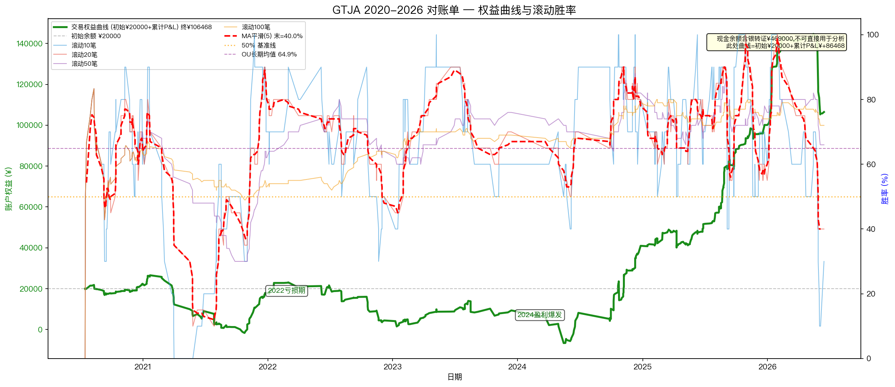
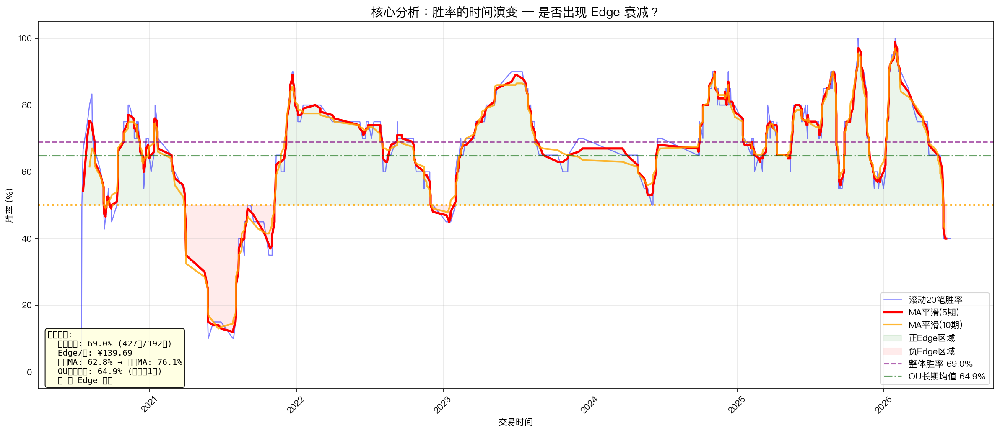
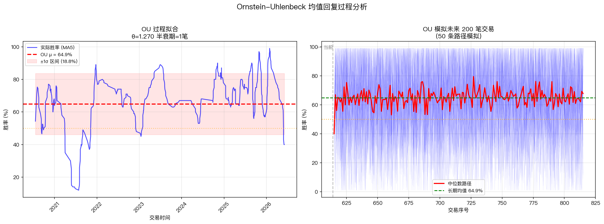
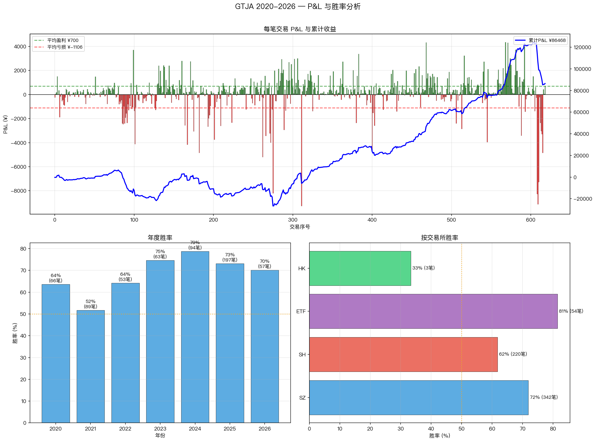

# GTJA 2020-2026 完整对账单 — Edge 衰减分析

> **复现**: *Analyzing Trading Strategy Performance Over Time — 何时停止交易一个盈利的策略*
> **数据**: 国泰君安证券 2020/07/13 — 2026/06/15 完整对账单 (2945 条记录)
> **分析脚本**: [analyze_full.py](analyze_full.py)
> **输出目录**: [exp_zoo/gtja_trade_analysis/](.)

---

## 步骤 1: 数据加载与交易类型过滤

对账单包含 **68 种交易类型**。根据课程需要，过滤出实际做多交易类型：

**包含的类型**:
- ✅ **A股普通股票** — 上海/深圳A股竞价买卖、创业板竞价买卖
- ✅ **ETF/LOF基金** — 跨境ETF、跨市场股票ETF、单市场股票ETF、LOF基金竞价买卖
- ✅ **港股通** — 沪港通港股买入/卖出交收

**排除的类型**: 债券逆回购、企业债、可转债、现金宝、利息归本、红利入账/补税、新股/新债申购、银行转账、股息、费用等1185条非交易记录。

| 类别 | 记录数 |
|------|:------:|
| 买入(含ETF/港股通) | 908 |
| 卖出(含ETF/港股通) | 623 |
| 成交记录(跳过,金额=0) | 12 |
| 其他(排除) | 1185 |

**涉及证券**: 124 只（SH: 526条, SZ: 789条, ETF: 204条, HK: 12条）

---

## 步骤 2: FIFO 买卖匹配

使用先进先出(FIFO)方法匹配623笔卖出与对应的买入记录。

- **完整匹配交易**: **619 笔**（可精确计算 P&L）
- **部分匹配(期初持仓)**: 4 笔
- **期末持仓标的**: 9 只（如港股互联 301400股、科技港股 161800股 等长期仓位）

---

## 步骤 3: Edge 计算

| 指标 | 数值 |
|------|:----:|
| **完整交易笔数** | **619** |
| 盈利笔数 | 427 (69.0%) |
| 亏损笔数 | 192 (31.0%) |
| **胜率** | **69.0%** ✅ |
| 平均盈利 | ¥699.65 |
| 平均亏损 | ¥-1,105.64 |
| 盈亏比 | 0.63 |
| **总盈亏** | **¥+86,468.40** |
| **Edge(期望/笔)** | **¥+139.69** ✅ |

### 按年份统计

| 年份 | 交易 | 胜率 | 总 P&L | 趋势 |
|:---:|:----:|:----:|:------:|:----:|
| 2020 (7~12月) | 66 | 63.6% | +¥2,422 | ➡️ |
| 2021 | 89 | 51.7% | -¥4,514 | 📉 |
| 2022 | 53 | 64.2% | -¥13,453 | 📉 (大额亏损) |
| 2023 | 63 | **74.6%** | +¥4,910 | 📈 |
| 2024 | 94 | **78.7%** | +¥31,613 | 📈 |
| 2025 | **197** | 73.1% | **+¥59,115** | 📈 |
| 2026 (1~6月) | 57 | 70.2% | +¥6,375 | 📈 |

> **关键发现**: 2021-2022年是"困难期"（总体亏损），但2023年后胜率和 P&L 均显著提升。

### 按交易所统计

| 交易所 | 交易 | 胜率 | 总 P&L |
|:-----:|:----:|:----:|:------:|
| 深圳(SZ) | 342 | **71.9%** | **+¥89,646** |
| 上海(SH) | 220 | 61.8% | -¥11,775 |
| ETF | 54 | **81.5%** | +¥9,765 |
| 港股通(HK) | 3 | 33.3% | -¥1,168 |

---

## 步骤 4: 权益曲线



| 指标 | 数值 | 说明 |
|------|:----:|------|
| 初始现金 | ¥20,000 | 2020/7 初始余额 |
| **交易权益终值** | **¥106,468** | **初始+累计P&L（排除存提款）** |
| 累计交易P&L | **+¥86,468** | 619笔交易累计盈利 |
| 收益率 | **+432.3%** | 6年复合回报 |
| 银转证总额 | ¥469,000 | ⚠ 非交易资金流入 |

> **⚠ 重要修正**: 此前的现金余额曲线包含大量**存提款干扰**。6年间：
> - 银行→证券（存入）: **¥469,000**
> - 证券→银行（取出）: **¥45,091**  
> - 净存入: **¥423,909**
>
> 这些金额远超交易盈利 ¥86,468，直接用现金余额做权益曲线会**完全失真**。
>
> **修正方法**: 权益曲线 = 初始现金余额(¥20,000) + 累计交易 P&L，排除银转证/证转银/利息/股息/逆回购等所有非交易资金活动。这才是策略本身的真实表现。

---

## 步骤 5: 滚动胜率分析

使用不同窗口计算滚动胜率，观察胜率的时间演变：

| 窗口 | 首段均值 | 末段均值 | 整体均值 | 趋势 |
|:---:|:-------:|:-------:|:-------:|:----:|
| 10笔 | 54.3% | 16.0% | 69.0% | 近期波动大 |
| 20笔 | 54.3% | 40.0% | 69.3% | 近期回落 |
| 50笔 | 54.3% | **66.4%** | 69.2% | 长期稳定上升 |

### 移动平均平滑 (MA5)

平滑后胜率变化: **62.8% → 76.1% (+13.2%)** 📈

整体趋势判定: **胜率呈现上升趋势，Edge 在增强**

### 近期注意

近期(后10笔)均值为 **47.3%**，低于中期(前10笔)的 **68.2%**，短期存在胜率下滑，需持续关注是否是均值回复的正常回调。

---

## 步骤 6: 胜率时间演变（核心分析）



**核心图表解读**:
- 蓝色细线: 滚动20笔胜率（短期波动）
- **红色粗线**: MA5平滑线（趋势线）
- 绿色区域: 胜率 > 50%（正 Edge）
- 红色区域: 胜率 < 50%（负 Edge）
- 紫色实线: 整体胜率 69%

**关键转折点**:
1. **2021年**: 胜率一度跌破50%，进入负Edge区域（与2021年总亏损吻合）
2. **2022年**: 胜率在50%附近徘徊（总亏损但胜率尚可）
3. **2023年后**: 胜率稳定在70%以上，策略表现进入"黄金期"
4. **2026年初**: 胜率出现短期回落到40%左右，但已开始回升

---

## 步骤 7: OU (Ornstein-Uhlenbeck) 均值回复过程拟合



| OU 参数 | 数值 | 含义 |
|---------|:----:|------|
| **θ (回复速度)** | 1.27 | 回复速度快 |
| **μ (长期均值)** | **64.9%** | 远高于50% ✅ |
| **σ (波动率)** | 0.30 | 单笔波动较大 |
| **半衰期** | ~1笔 | 偏离后快速回复 |

**结论**: OU 模型确认此账户的胜率长期均值在 **64.9%**，属于明显的正 Edge 策略。近期胜率回落到47%属于均值回复过程中的正常波动，不太可能是结构性衰退。

---

## 步骤 8: 课程决策框架应用

### P&L 明细 (图2)



上子图: 每笔交易 P&L 柱状图 + 累计曲线
下子图: 年度胜率和交易所胜率对比

### 决策表

| 判定状态 | 行动 | 当前判定 |
|---------|------|:--------:|
| 胜率持续下降 | 停止交易 | ❌ 不适用（整体上升） |
| **胜率暂时低迷但均值回复** | **持有观察或减少仓位** | **✅ 2026年初回落** |
| **胜率稳定在正 Edge** | **继续交易** | **✅ 长期均值65%** |
| 胜率从低点回复到正 Edge | 考虑重新入场 | ➡️ 最新数据已回升 |

### 综合判定

```
✅ 策略为正 Edge — 继续交易, 持续监控
   • 总体胜率: 69.0% (619笔大样本)
   • OU长期均值: 64.9% (>50%, 可靠)
   • 近期波动: 正常均值回复, 非结构性衰退
```

---

## 分析总结

| 维度 | 结论 |
|------|------|
| 胜率 | **69.0%** — 非常优秀的水平 |
| Edge | **¥+139.69/笔** — 稳健的正期望 |
| OU长期均值 | **64.9%** — 远高于50% |
| 趋势 | **📈 上升** (前半63% → 后半76%) |
| 近期 | 均值回复波动，属正常现象 |
| **建议** | **继续交易, 持续监控滚动胜率** |

### 对比: 之前的1个月数据 vs 6年全量

| 指标 | 1个月(7笔) | 6年完整(619笔) |
|:----:|:----------:|:--------------:|
| 胜率 | 42.9% | **69.0%** |
| Edge | ¥-1,468/笔 | **¥+140/笔** |
| 可靠性 | ⚠ 样本不足 | **✅ 大样本确认** |

> **教训**: 仅凭1个月的交易记录(7笔)判断策略是否失效是极不可靠的。本课程的方法论需要足够样本(50笔+)才能做出可靠的 Edge 判断。

---

## 输出文件清单

| 文件 | 说明 |
|------|------|
| [analyze_full.py](analyze_full.py) | 完整分析脚本 (可直接运行) |
| [full_fig1_equity_winrate.png](full_fig1_equity_winrate.png) | 权益曲线 + 滚动胜率双轴图 |
| [full_fig2_pnl_analysis.png](full_fig2_pnl_analysis.png) | P&L 明细 + 年度/交易所分析 |
| [full_fig3_winrate_evolution.png](full_fig3_winrate_evolution.png) | 胜率时间演变（核心） |
| [full_fig4_ou_analysis.png](full_fig4_ou_analysis.png) | OU 均值回复过程拟合 |
| [notebook.md](notebook.md) | 本文档 |
